# Introducing the BenchBox Results Explorer

> A Geekbench for data platform benchmarks

**TL;DR**: Results Explorer allows BenchBox users to share and compare their own benchmarking results with results shared by the BenchBox community. Anyone can submit a run for publication through a pull request.

BenchBox makes data platform benchmarking simple by executing consistent and clearly documented benchmarking using well-known (and clearly defined) benchmarks against a large set of popular data platforms using the most popular language for data engineering.

The new [Results Explorer](https://benchbox.dev/results/) feature allows you to share verifiable and reproducible benchmarking results publicly so the data engineering community can benefit from shared efforts. Previously, a BenchBox user could only see their own results. All runs for a comparison had to be conducted by them at their own expense.

Likewise, benchmarking blog posts and PR announcements are (at best) backed up by results on GitHub shared as shell scripts and CSVs. It's time-consuming to validate the shared assets and determine whether they are trustworthy and reproducible. Common concerns: ran with very large compute, used special tunings, used a modified benchmark, used a specific cloud provider, etc.

A shared benchmark result is only useful if someone else can easily understand how it was run and easily compare it to other results.

---

## Inspirations

BenchBox's Results Explorer has two strong inspirations: Geekbench's shared CPU benchmarks and AI/LLM leaderboards.

Geekbench allows you to benchmark the performance of your own computer and share the results. The results are widely used when new CPUs are released. For example, coverage of the new iPhone A20 processor that mentions "more than 20% faster" is based on comparing Geekbench scores.

* [Geekbench Browser: iOS benchmarks](https://browser.geekbench.com/ios-benchmarks)


* [Tom's Hardware: Apple's A20 Pro shatters Geekbench 7 single-core record](https://www.tomshardware.com/pc-components/cpus/apples-a20-pro-shatters-geekbench-7-single-core-record-2nm-chip-beats-desktop-intel-core-i9-and-amd-ryzen-9-by-up-to-32-percent)


We borrowed Geekbench's path from a local run to a public page others can inspect and compare, not its single headline score: BenchBox ranks runs only within one benchmark, scale factor (data size), and phase.

AI/LLM leaderboards have become a ubiquitous feature of the AI arms race. These leaderboards synthesize LLM performance across diverse benchmarks to provide a holistic view of highly variable performance (sound familiar?). There are a number of these leaderboards, but a few good examples are:

* [Terminal-Bench leaderboard](https://hub.harborframework.com/datasets/terminal-bench/terminal-bench/latest?tab=leaderboard&leaderboard=4-0-0)


* [Arena text leaderboard: Pareto frontier](https://arena.ai/leaderboard/text/pareto)


* [LLM Stats](https://llm-stats.com/)


* [Scale Labs agentic leaderboards](https://labs.scale.com/leaderboard?category=agentic)


---

## Trust model

BenchBox result publication relies on a trust model using packaging-time hashes and local machine IDs.

* Runs record an anonymous machine ID locally so runs from the same hardware can be compared; public bundles drop it.
* A result integrity hash is calculated when you package a run with `benchbox submit`. CI checks it to confirm the result has not been modified since packaging.
* Result submissions go through a GitHub PR review by BenchBox maintainers before public release.

To provide reproducible results, BenchBox result "bundles" include all of the details necessary to interpret and (if needed) reproduce and validate the benchmarking. Bundles specify:

1. **Hardware used**, when recorded: CPU model, CPU count, total RAM, OS release, and client-to-engine locality
2. **Platform version**: DuckDB 1.4.4, 1.5.5, 2.0.0-alpha38615, etc.
3. **Benchmark configuration**: Scale factor, execution phase, memory limits, thread limits, and tuning mode

To support public sharing of results, bundles also record:

1. **Run Validation**: Row counts and schema validation against known references.
2. **Run Provenance** (added in BenchBox v0.4.0): User type (maintainer, vendor, or community) and funding (employer, personal, free-trial, grant, vendor-sponsored, or unspecified, the default).

---

## Walkthrough

The Explorer has six tabs: Overview, Benchmarks, Platforms, Compare, Find runs, and Open local result. Each one answers a single question, and every run you see links through to its own result page.

### 1. Overview

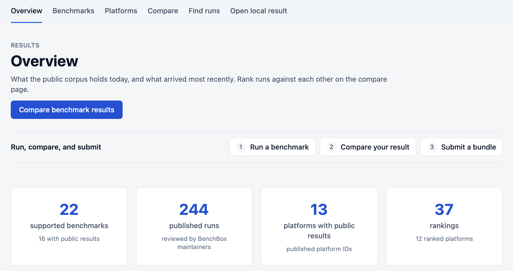

Overview (`/results/`) answers the first question anyone asks: what's here, and what's new? You don't need to set a filter. Four counts sit at the top: supported benchmarks, published runs, platforms, and rankings. As of this post, that's 244 published runs across 13 platforms. This initial set of results is exclusively small scale (scale factor 10 or smaller) and maintainer-run today. It is intended to seed the project and demonstrate its value. Below the counts, Recent results lists the latest arrivals, and three numbered shortcuts take you from running a benchmark to comparing your result to submitting a bundle.

### 2. Benchmarks

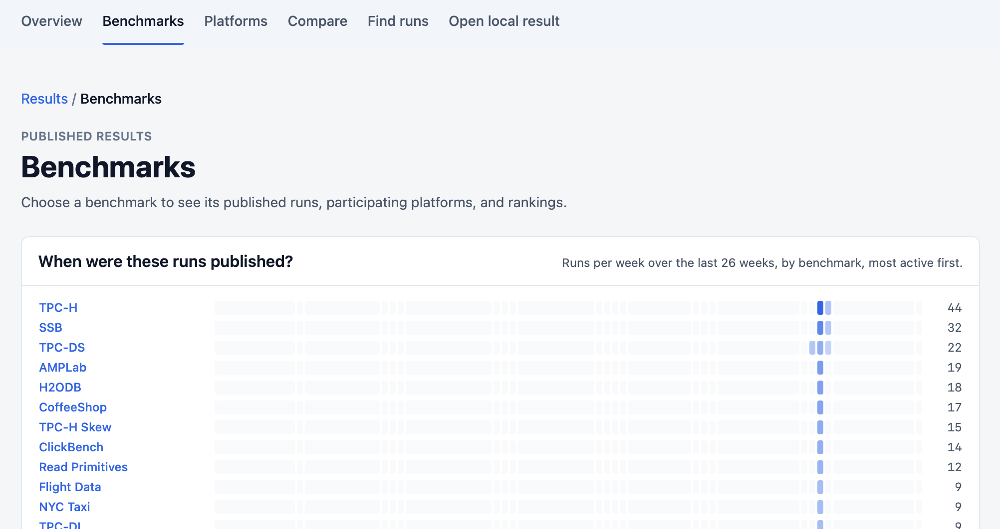

Benchmarks (`/results/benchmarks/`) lists every benchmark with public results, next to a strip showing how many runs arrived each week over the last 26 weeks. TPC-H leads with 44 runs.

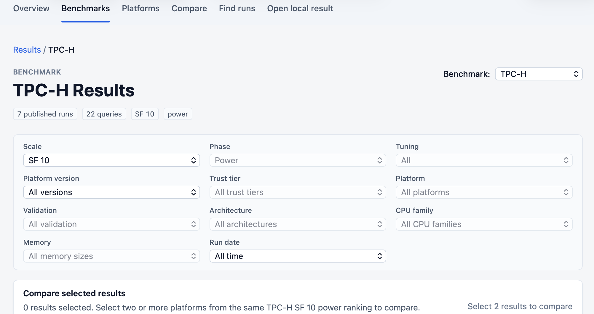

Pick a benchmark and its page (`/results/:benchmark/`) shows one ranking at a time. Every ranking holds one scale factor and one test phase (such as the power test, which runs the queries in a single stream), because performance depends on the queries, the schema, and the data size. Scale factor (SF) sets the data size; for TPC-H, SF 10 is about 10 GB, and other benchmarks size data differently. That rule keeps an SF 1 run from ever ranking against an SF 10 run. TPC-H at SF 10 in the power phase holds seven published runs, one for each DuckDB release.

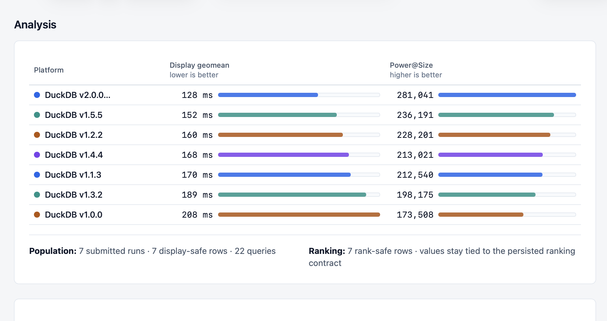

The Analysis section sets two measures side by side: display geomean (the geometric mean of per-query times), where lower is better, and Power@Size (the TPC-H power metric), where higher is better. The 2.0.0 alpha leads on both, at 128 ms and 281,041. Release order doesn't hold all the way down: 1.3.2 sits at 189 ms and 198,175, behind 1.2.2.

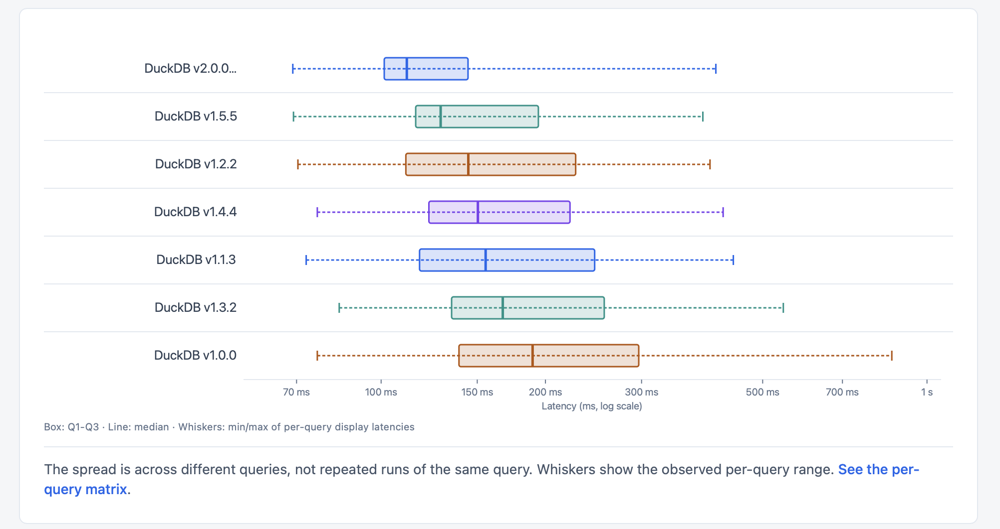

A box plot shows how much latency varies from query to query within each run. The spread comes from different queries, not repeated runs of the same query, so a long whisker marks a slow query rather than run-to-run noise.

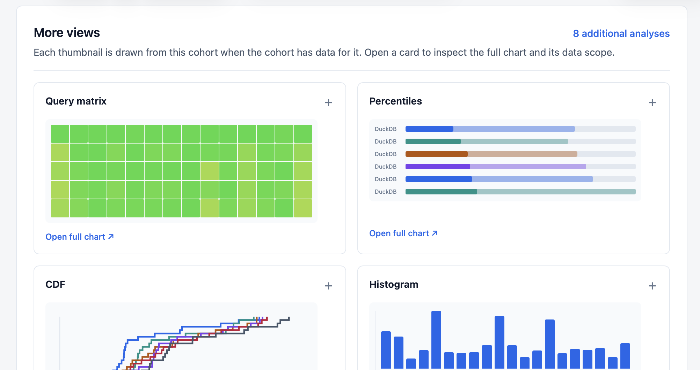

More views holds eight further analyses drawn from the same ranking, including a query matrix, percentiles, a CDF (the share of queries finished by each latency), and a histogram. The query matrix shows whether a lead holds across queries or rests on one outlier.

### 3. Platforms

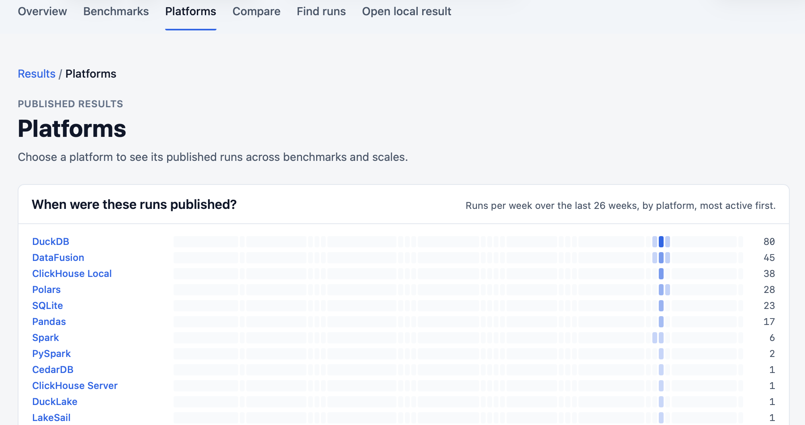

Platforms (`/results/platforms/`) lists every platform with the same weekly strip. DuckDB has the most published runs, with 80.

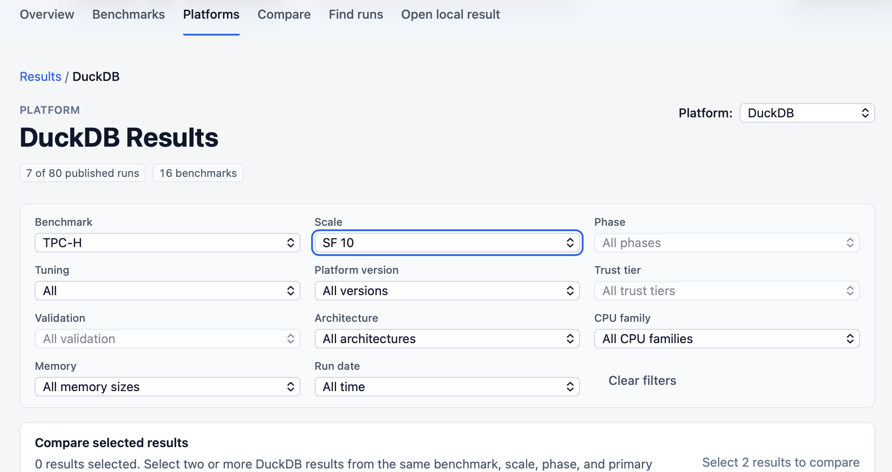

A platform page (`/results/p/:platform/`) follows one engine across every workload it has run. It's also where version history lives: did a release get faster, or did it regress? Filtered to TPC-H at SF 10, the DuckDB page shows seven releases that ran on Apple silicon on the same day, with no tuning. Architecture, CPU family, and memory filters let you line up versions on similar hardware, when the runs record it.

The measurement basis decides which timings you see. Choose all warm passes, the warmup pass alone, or a single named warm pass, then reduce each query's timings by median or fastest. Whole-run wall-clock totals appear for context only, and there is no CPU-time basis.

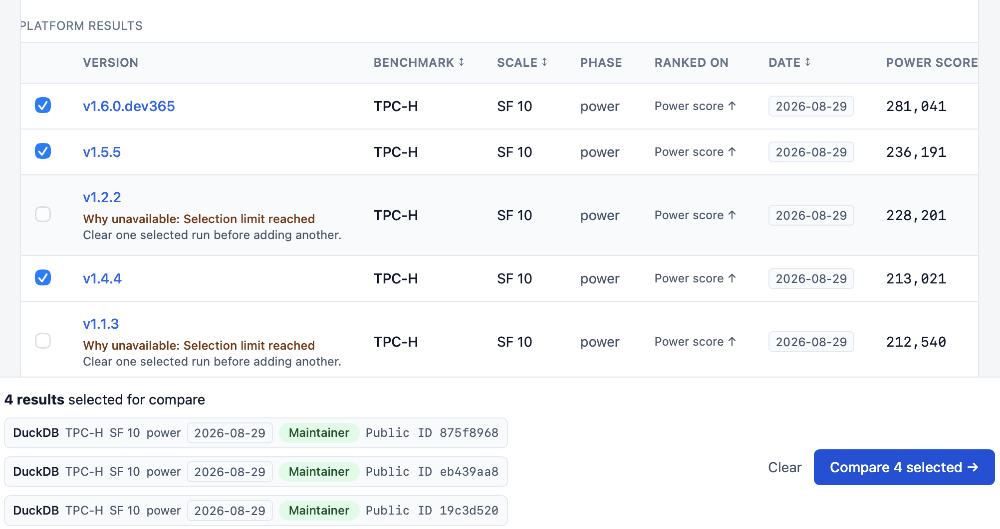

Each version in the results table links to that run's page, and its checkbox adds the run to a comparison. Power score (higher is better) climbs from 173,508 on 1.0.0 to 281,041 on the 2.0.0 alpha, which the table lists under its driver build, v1.6.0.dev365. The climb isn't steady: 1.3.2 scored 198,175, below 1.2.2's 228,201. A tray at the bottom of the page collects your picks. After four, the remaining rows explain that the selection limit is reached.

### 4. Compare


Compare (`/results/compare?ids=...`) puts up to four runs side by side. The screenshots follow [four DuckDB releases on TPC-H SF 10](https://benchbox.dev/results/compare?ids=6235bd1a,47bdcef5,282a4d75,19b96c85): the 2.0.0 alpha, 1.5.5, 1.4.4, and 1.3.2. Before it shows any numbers, a "Before you compare" panel confirms the runs share a benchmark, scale factor, and phase, then lists fields that differ as warnings and marks fields a run didn't record as Not recorded. These runs carry two warnings, platform version and driver version: expected for a version-history question, but worth reviewing before calling a winner.

The Comparison summary comes next. In these runs, the 2.0.0 alpha's power score was 1.42x that of the lowest selected run, 1.3.2, and the summary counts 20 of 22 queries where the alpha wins. Its latency profile reads 111 ms at p50, 274 ms at p90, and 395 ms at p99.

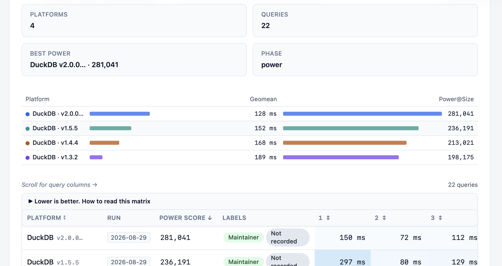

Below the summary, bars compare each run's geomean and Power@Size, and a query matrix lays out every query's time for every run, so you can see where a release gained or lost ground.

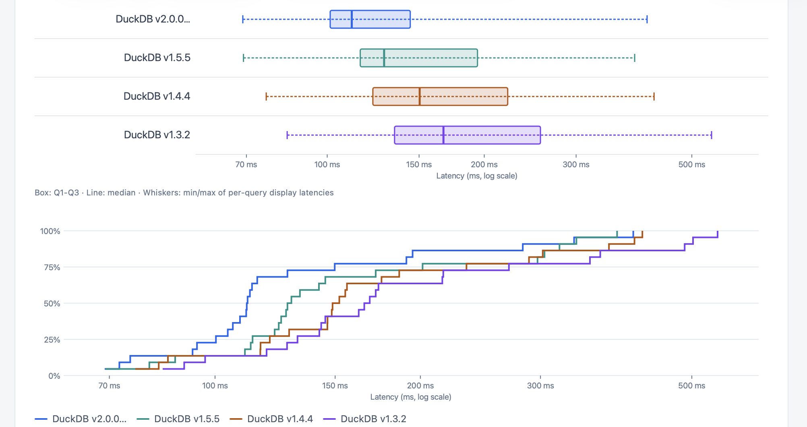

Box plots and a CDF show each release's whole latency distribution. The 2.0.0 alpha's curve sits furthest left, so more of its queries finish sooner. Further down, a Platform and hardware panel marks which details differ between runs and which were never recorded. Compare also states a hardware boundary: CPU count and memory are not recorded for every run, so it compares recorded runs, not platforms in isolation. When runs don't share a scale factor, Compare still shows the evidence but won't name a winner.

### Result pages

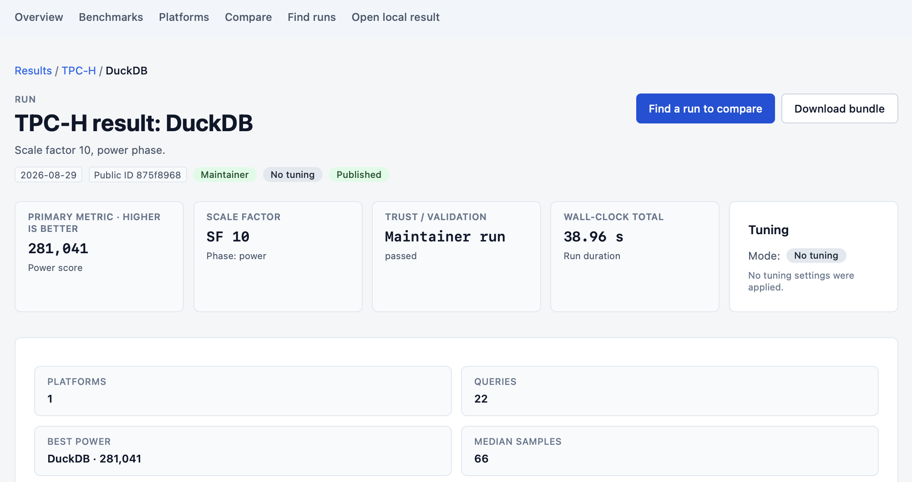

Every run you see links through to its own page (`/results/r/:id`). The 2.0.0 alpha's page shows its power score of 281,041, its scale factor and phase, its trust and validation state, a wall-clock total of 38.96 seconds, and its tuning mode. Find a run to compare starts a comparison from this run, and Download bundle takes the canonical JSON with you, for your own analysis or to set up a corroborating run.

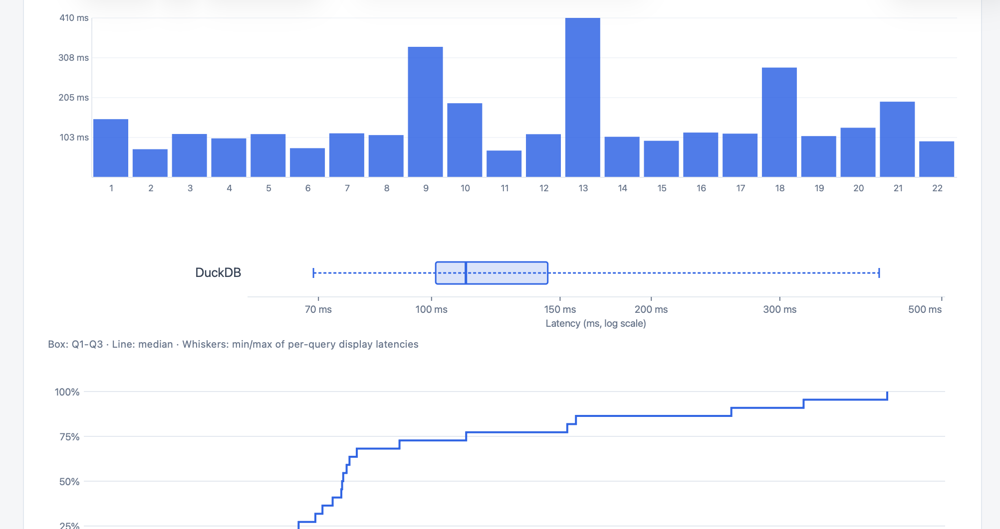

Further down, the page charts each query's time, the spread across queries, and a CDF, followed by a run receipt with provenance and hardware details when recorded.

### 5. Find runs

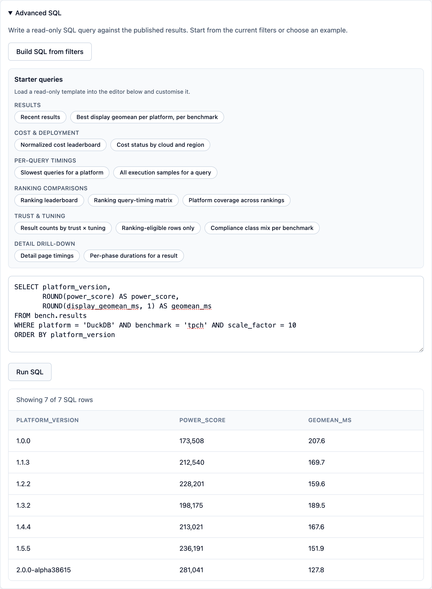

Find runs (`/results/query`) does two jobs. The first is search: filter by benchmark and platform, or search by platform, version, or public ID, then select up to four runs to compare. The second is SQL, for questions the built-in views don't answer. Open Advanced SQL, load a starter query or build one from your current filters, and run it. The query in the screenshot lists every DuckDB release at TPC-H SF 10 with its power score and geomean. Your browser does the work. DuckDB-WASM queries a static `results.duckdb` file, with no application server involved. When you're done, download the filtered rows as CSV or JSON.

### 6. Open local result

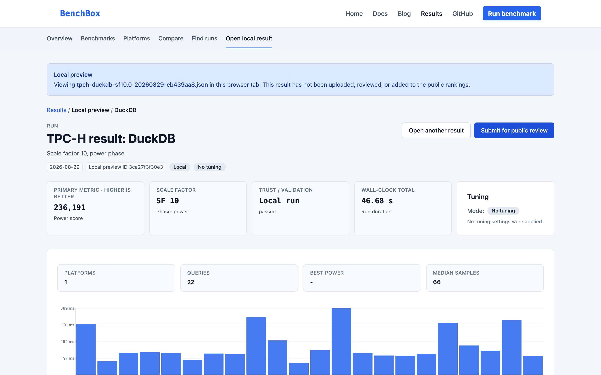

Open local result (`/results/local`) answers the question every contributor has before sharing: how does my run look? Pick a result JSON file and the Explorer parses it in your browser. The screenshot shows the published DuckDB 1.5.5 SF 10 bundle opened this way. Nothing is uploaded, and a banner says so. Your run gets the same cards, tables, and charts as a public result, though a preview isn't ranked and has no bundle download or Find a run to compare button.

It's a preview, though. The Explorer checks the file's shape, derives timings, and shows the validation status the run recorded. It doesn't re-verify checksums, classify tuning, or decide whether the run can be submitted. `benchbox submit` checks whether a run can be submitted, and the Submit for public review button links to the guide that walks you through it.

---

## How it works

The Explorer has no application server, account system, or server-side database. A static build turns curated result bundles into a DuckDB snapshot and downloadable JSON, GitHub Pages serves both, and DuckDB-WASM runs every query in your browser.

```text
curated result bundles -> static build -> results.duckdb -> every Explorer page, including Find runs
                                  `-> JSON bundles -> Download bundle
```

That keeps the site cheap to run and the evidence portable: use the pages, query the snapshot, or leave with the bundle.

---

## Contribute in 3 steps

1. Run a benchmark

   ```bash
   uv add benchbox --extra duckdb
   uv run -- benchbox run --platform duckdb --benchmark tpch --scale 1
   ```

2. Package with `benchbox submit`

   - One private, stable salt pseudonymizes the identifiers a public bundle keeps, such as endpoints and database names
   - A new salt per run makes those identifiers inconsistent across your submissions
   - Keep it out of the repo and the PR

   ```bash
   export BENCHBOX_MACHINE_ID_SALT="<stable-private-random-value>"
   uv run -- benchbox submit --last --dry-run
   uv run -- benchbox submit --last --output ./submission
   ```

   - Refuses runs that aren't submittable
   - Writes the bundle plus a SHA-256 manifest
   - The hash covers file integrity, not query correctness

3. Open a PR against `published-results`

   - Fork [BenchBox-dev/BenchBox](https://github.com/BenchBox-dev/BenchBox)
   - Copy the contents of `submission/bundle/` plus the manifest into `results-data/bundles/`
   - Regenerate the inventory: `uv run -- python scripts/generate_corpus_inventory.py --write`
   - Keep the PR data-only: result JSON, companions, manifest, and inventory
   - Title the PR `results: <benchmark> <platform> sf<scale>`
   - CI checks the schema, manifest hash, and timing sanity, then posts a summary
   - Maintainers review the PR
   - Merged runs appear in the Explorer after a later curated publish, not at merge
   - Ranked tables include maintainer-run, CI, and vendor-supplied results (vendor results carry a badge). A run also needs clean validation and no failed queries to rank.
   - Community results carry a Community submission label and are currently excluded from ranked tables. We will re-evaluate their inclusion over the coming months.

Full details: [Contributing Benchmark Results](https://benchbox.dev/docs/contributing-results.html)

---

## Next steps

- Explore the data: [benchbox.dev/results](https://benchbox.dev/results/)
- Inspect your own runs: open [benchbox.dev/results](https://benchbox.dev/results/) and use **Open local result**
- Contribute one back: `benchbox submit`, then a PR
- Tell us what to cover next: which benchmarks, platforms, and scales? Start a [BenchBox discussion](https://github.com/BenchBox-dev/BenchBox/discussions).

---

## References

1. [BenchBox Results Explorer](https://benchbox.dev/results/)
2. [Geekbench Browser: iOS benchmarks](https://browser.geekbench.com/ios-benchmarks)
3. [Tom's Hardware: Apple's A20 Pro shatters Geekbench 7 single-core record](https://www.tomshardware.com/pc-components/cpus/apples-a20-pro-shatters-geekbench-7-single-core-record-2nm-chip-beats-desktop-intel-core-i9-and-amd-ryzen-9-by-up-to-32-percent)
4. [Terminal-Bench leaderboard](https://hub.harborframework.com/datasets/terminal-bench/terminal-bench/latest?tab=leaderboard&leaderboard=4-0-0)
5. [Arena text leaderboard: Pareto frontier](https://arena.ai/leaderboard/text/pareto)
6. [LLM Stats](https://llm-stats.com/)
7. [Scale Labs agentic leaderboards](https://labs.scale.com/leaderboard?category=agentic)
8. [Contributing Benchmark Results](https://benchbox.dev/docs/contributing-results.html)
