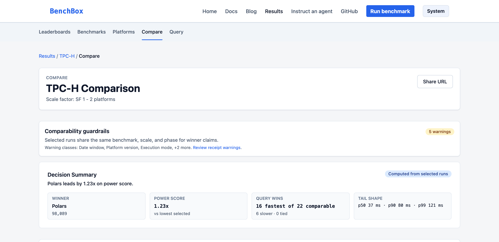
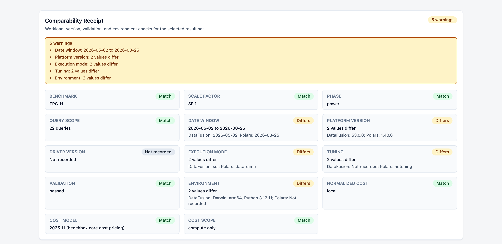
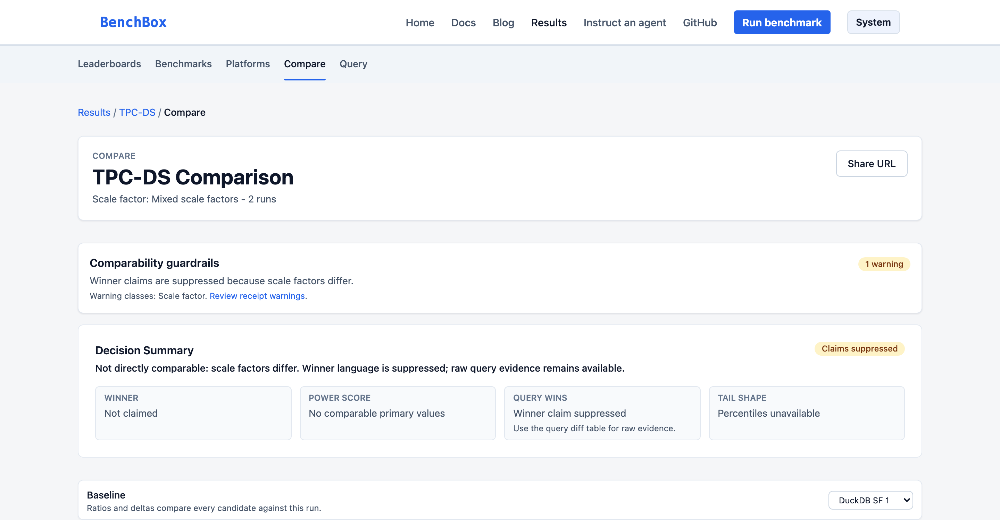

# When two timings are not a comparison

> Two timings in the same chart are not yet a comparison. The Results Explorer decides what may be displayed, compared, and ranked, and it leaves the rest visible.

**TL;DR**: BenchBox v0.4.0's [Results Explorer](https://benchbox.dev/results/) is a curated preview that will show a timing that is not rankable, compare runs that share enough query evidence, and refuse a winner claim when benchmark, scale factor, phase, or timing coverage does not line up.[^release] Other recorded differences stay on a Comparability Receipt for the reader to judge. The preview makes evidence easier to inspect. It does not certify every result.

---

## Two timings are not a comparison

One published result says 12 seconds. Another says 31. On a results site those two numbers will sit in the same chart whether or not they measured the same work.

Whether they used the same benchmark, scale factor, and phase, whether they share enough valid query timings, whether any query failed, and whether they ran as SQL or DataFrame: those are not optional footnotes. The interesting engineering in the Explorer is teaching the read model which numbers belong together.

The [live snapshot](https://benchbox.dev/results/) makes that concrete. Open TPC-H at scale factor 1, power phase: DataFusion in SQL mode and Polars in DataFrame mode are both ranking-eligible.[^snapshot] They share a workload identity. They do not share an execution mode. That pair is the comparison this post walks through.

## What we tried

A public results site can be a pre-rendered JSON leaderboard, a hosted submission API, or a static database that the browser queries. We shipped the third.

The JSON path would start faster. It could not offer a SQL workbench over the same tables the pages use. A hosted API would make contribution feel instant and would add a service that can rot, leak, or go down mid-launch. The curated preview, and the planned pull-request contribution path, need zero backend services. The API stays deferred until demand justifies the operational burden.

We also reversed an earlier design call. The first framing rejected leaderboards as vanity ranking. Visitors still want a platform-by-query matrix as a landing view. The fix was not to hide the ranking. It was to make ranking refuse ineligible rows, with a named reason on the missing row.

Environment equivalence was the other tempting hard gate. The launch snapshot has 11 complete environment records out of 138 results, and no recorded driver versions. Enforcing environment match as a blocker would empty most of the site. We block the mismatches we can define reliably (canonical benchmark, scale factor, phase, and shared valid timing coverage) and expose the rest as warnings.

## A comparison that is allowed, and one that is not

Here is that TPC-H SF1 power pair on the Compare page, using the public short IDs `e3aaa125` (DataFusion SQL) and `9187e38f` (Polars DataFrame):[^compare-urls]



Winner language still appears. The guardrail states that the runs share benchmark, scale, and phase, and it points at five receipt warnings, including execution mode. That number is not a platform ranking in this post. It is evidence that a warning can coexist with a displayed winner.

The receipt itemizes those warnings:



Benchmark, scale factor, and phase match. Execution mode differs: `sql` versus `dataframe`. Driver version is missing on every selected run, so it shows "Not recorded" and does not add to the warning count.

That is the warning class, not the hard gate. Same engine, same benchmark family, different scale: DuckDB TPC-DS power at SF 1 versus SF 10 (`f552fd5d` and `aa8b0fad`):



The page still shows per-query evidence. It will not say which run won. Scale factor is a hard gate. Execution mode is not.

| Check | Explorer behavior |
| --- | --- |
| Canonical benchmark | A mismatch suppresses winner and ranking claims |
| Scale factor | A mismatch suppresses winner and ranking claims |
| Test phase | A mismatch suppresses winner and ranking claims |
| Shared valid timing coverage | Insufficient overlap suppresses the comparison claim |
| Platform and driver versions | Recorded differences appear as warnings |
| Validation and execution mode | Recorded differences appear as warnings |
| Environment and run date | Recorded differences appear as warnings |
| Tuning, physical mechanisms, and cost metadata | Recorded differences appear as warnings |
| A field missing for every selected result | Shown as "Not recorded," without increasing the warning count |

The severe cohort check canonicalizes the benchmark and phase before comparing them, so aliases and letter case do not create false matches or false mismatches.[^compare] A platform-version warning may sit next to a displayed winner claim. The receipt helps the reader judge. It does not certify equivalence.

## Displayable is not comparable is not rankable

The naive implementation of a leaderboard is `ORDER BY`. Sorting silently asserts that every row belongs in the same list. For benchmark results that assertion is usually wrong.

The Explorer treats admission, display, comparison, and ranking as separate decisions.

```text
result bundle -> admission -> published evidence
                                  |-> display: can this timing be shown?
                                  |-> comparison: is there enough shared query evidence?
                                  `-> ranking: does this row satisfy ranking policy?
```

**Admission** happens before the browser build. A result bundle must satisfy schema, policy, and corpus checks before it enters the published input set. Admission answers whether the project can publish the evidence at all. It does not promise that the evidence belongs in a ranking.

**Display** asks whether a timing is valid enough to show. Missing, zero, non-finite, or otherwise excluded timings should not quietly become chart points. A result can still have useful provenance or capability evidence when its primary timing is unavailable.

**Comparison** asks whether selected runs share enough valid query evidence. The released implementation requires at least two common valid query timings. It also requires each selected result to cover at least half of the query IDs present in the selection, with a minimum of two.[^eligibility] Identical query sets would empty most comparisons in this corpus. Disjoint geomeans would invent a race. We picked a floor, not equivalence. The headline metric remains each result's own display geomean, so selected runs can still summarize different subsets.

The coverage check is small, and it runs only after each selected result is itself comparable:

```typescript
const queryIds = [...new Set(results.flatMap(
  (result) => result.display_timings.map((timing) => timing.query_id),
))];
const requiredValidQueriesPerResult = Math.max(2, Math.ceil(queryIds.length * 0.5));
const commonValidQueries = countCommonValidQueries(results, queryIds);

if (commonValidQueries < 2) {
  return {
    comparable: false,
    reason: EXCLUSION_LABELS.insufficient_common_valid_timings ??
      "Selected runs do not share enough valid timings.",
    totalQueries: queryIds.length,
    commonValidQueries,
    requiredValidQueriesPerResult,
  };
}
```

The live exclusion label for that branch is "Selected runs do not share at least two valid query timings." A separate check rejects a result whose valid timing count is below `requiredValidQueriesPerResult`.

**Ranking** is narrower still. A result can be displayable and comparable and remain outside ranked tables because of failed queries, unclean validation, insufficient query coverage, or trust policy. Named reasons include "One or more queries failed" and "Validation status excludes this result from ranking." A missing row should explain itself instead of disappearing.

On the August 28 snapshot those layers read 138 admitted results, 134 displayable, 105 comparable, and 55 rankable.[^snapshot]

## A database in the browser, no API

The Explorer's read path is a static file. The released site serves an 8,400,896-byte DuckDB snapshot, and DuckDB-WASM attaches it read-only in the visitor's browser.[^database] The application pages and the SQL workbench query the same tables.

There is no application API, authentication service, or database server in that read path. That keeps the launch architecture small. It is not a security guarantee. Static hosting, CDN behavior, the build pipeline, publication permissions, and the contents of the snapshot still matter.

The snapshot is also not the only published artifact. The launch site serves 138 downloadable JSON result bundles, one per snapshot row, alongside the DuckDB file. DuckDB-WASM is the store for user-visible metrics. The JSON remains available for downloading and inspecting individual evidence bundles.

```text
admitted bundles -> static build -> results.duckdb -> DuckDB-WASM -> pages and SQL workbench
                              `-> JSON bundles ------------------> individual downloads
```

Running DuckDB in the browser has a cold-start cost that pre-rendered JSON would avoid. In return, visitors get a SQL workbench over the same read model used by the site. Browser tests pin those costs as CI thresholds, not production latency: DuckDB-WASM cold init P50 4s / P95 6s, leaderboard data after init P50 1.5s / P95 2.5s, leaderboard render after data P50 0.5s / P95 1s, and query workbench first paint after init P50 0.6s / P95 1.2s.

If the browser cannot attach the snapshot, the site reports an error rather than rendering a plausible empty leaderboard. An empty state and a failed data load mean different things.

## A validation pass on zero queries is a non-measurement

Eligibility rules are only as useful as the evidence entering them. Two corpus corrections immediately before v0.4.0 showed why admission has to require proof of execution, not only a passing status field.[^corpus]

On August 24, the project withdrew 60 legacy DataFrame bundles. Each reported `summary.validation=passed` after executing zero queries. Those were not partial benchmark results. They were non-measurements that satisfied a vacuous check.

Removing only those files would have left ten raw benchmark and scale-factor groups below the project's three-represented-platform corpus floor. The project therefore withdrew 17 additional SQL bundles from those groups. Those 17 had truthful measurements and were not classified as invalid. They were removed so thin groups would not be presented as supported comparison coverage.

AMPLab, CoffeeShop, and H2O-DB at SF 0.1 and 1.0, SSB at SF 1.0, and TSBS DevOps at SF 0.01, 0.1, and 1.0 left the published corpus. The SF 0.01 groups for AMPLab, CoffeeShop, and H2O-DB remain. A group can return when it has at least three truthful platform results. Fresh DataFrame results also need real validation evidence.

On August 25, a second review found 52 retained bundles whose summary claimed validation `passed` or `partial` while the recorded validation phase was `NOT_RUN`. The correction changed 23 passed claims and 29 partial claims to `not_run`. It did not rewrite timings or failure records. It kept the bundles as non-ranking capability evidence.

Admission now rejects the same contradiction: a summary cannot claim passed or partial validation when the validation phase records no run.

That is the general lesson. A validation status should establish both that the checks passed and that the work being checked actually ran. When that evidence is absent, a visible gap is more accurate than a filled-in status. The snapshot mix after those corrections is 56 passed, 30 partial, and 52 not run, with 55 ranking-eligible rows.

## Query the same table the pages use

Start at the [Results Explorer root](https://benchbox.dev/results/) and open **Query**. The workbench exposes `bench.results`, the same result table used by the application.

This query lists the TPC-H SF1 power rows the mixed-mode walkthrough used, including the ranking split:

```sql
SELECT
  platform,
  execution_mode,
  is_ranking_eligible,
  result_id
FROM bench.results
WHERE benchmark = 'tpch'
  AND scale_factor = 1
  AND test_type = 'power'
ORDER BY is_ranking_eligible DESC, execution_mode, platform;
```

On the captured August 28 snapshot, the ranking-eligible rows in that set are DataFusion and Spark in SQL mode, and Polars and PySpark in DataFrame mode.[^snapshot]

To see how 138 admitted results become 55 rankable ones:

```sql
SELECT
  validation_status,
  is_ranking_eligible,
  COUNT(*) AS results
FROM bench.results
GROUP BY validation_status, is_ranking_eligible
ORDER BY validation_status, is_ranking_eligible;
```

That returns 52 not-run and non-ranking results, 30 partial and non-ranking, one passed but non-ranking, and 55 passed and ranking-eligible.

From there, open the two Compare URLs above, or pick the same rows from a result detail. Check methodology disclosure, provenance, validation, query coverage, and environment. Download the JSON bundle if you need the evidence outside the browser. A fresh local run can provide independent corroboration. It will not guarantee the same timing: hardware, software, configuration, background load, and data paths can all change the measurement.

## What this preview does not establish

The Explorer establishes a visible qualification process, not universal comparability. The August 28 snapshot is 138 maintainer-run rows with funding `unspecified`. Platform coverage is uneven (DataFusion 48, Spark 19, DuckDB and Polars 18 each, PySpark 17, SQLite 16, ClickHouse Local and LakeSail one each). Those counts describe this dated snapshot, not permanent support levels or a representative sample of the database market.

It does not cover every platform, benchmark, environment, or funding source. It does not make results from different hardware equivalent. It does not turn a warning-free receipt into independent certification.

The public contribution guide and the Explorer's **Submit a bundle** link describe a pull-request workflow, but the corpus README says community contributions are not yet open. The public guide also still points contributors to the old GitHub repository name. A submission therefore should not be read as automatic inclusion in the Explorer.[^contributions] For this preview, the dependable actions are to browse, audit, and [open an issue](https://github.com/BenchBox-dev/BenchBox/issues) when a result or explanation needs correction.

What the preview can do is narrower and useful: refuse some unsupported winner claims, show why rows are excluded, expose recorded differences, and let readers query and download the same public evidence. For benchmark results, an honest missing field is more informative than precision the corpus cannot support.

---

## References

[^release]: [BenchBox 0.4.0 release](https://github.com/BenchBox-dev/BenchBox/releases/tag/v0.4.0), published August 28, 2026.
[^snapshot]: [Deployed Results Explorer DuckDB snapshot](https://benchbox.dev/results/data/results.duckdb), read August 28, 2026. Captured SHA-256: `83cf3c7ffe56ad6f89c53944e66d9c18aa794d3985c89ae87588fb57a2398863`.
[^compare-urls]: Live Compare pages for the walkthrough pairs: [TPC-H SF1 DataFusion SQL vs Polars DataFrame](https://benchbox.dev/results/compare?ids=e3aaa125,9187e38f) and [DuckDB TPC-DS SF1 vs SF10](https://benchbox.dev/results/compare?ids=f552fd5d,aa8b0fad). GitHub Pages serves unknown `/results/` paths through a 404 restore into the SPA; those URLs open Compare in a browser.
[^eligibility]: [Display and comparison eligibility implementation at the v0.4.0 tag commit](https://github.com/BenchBox-dev/BenchBox/blob/f841b85f1d40cc2396f16fb185d1dfbb371ac1a3/results-explorer/src/lib/displayEligibility.ts).
[^compare]: [Compare page cohort and claim-suppression logic at the v0.4.0 tag commit](https://github.com/BenchBox-dev/BenchBox/blob/f841b85f1d40cc2396f16fb185d1dfbb371ac1a3/results-explorer/src/pages/Compare.tsx) and [Comparability Receipt implementation](https://github.com/BenchBox-dev/BenchBox/blob/f841b85f1d40cc2396f16fb185d1dfbb371ac1a3/results-explorer/src/components/ComparabilityReceipt.tsx).
[^database]: [Results Explorer database attachment at the v0.4.0 tag commit](https://github.com/BenchBox-dev/BenchBox/blob/f841b85f1d40cc2396f16fb185d1dfbb371ac1a3/results-explorer/src/db.ts).
[^corpus]: [Corpus generation and correction notes at the v0.4.0 tag commit](https://github.com/BenchBox-dev/BenchBox/blob/f841b85f1d40cc2396f16fb185d1dfbb371ac1a3/results-data/CORPUS_NOTES.md).
[^contributions]: [Public contribution guide](https://benchbox.dev/docs/contributing-results.html), [corpus contribution status at the v0.4.0 tag commit](https://github.com/BenchBox-dev/BenchBox/blob/f841b85f1d40cc2396f16fb185d1dfbb371ac1a3/results-data/README.md#contributing-via-pull-request-phase-2), and [Explorer submission link at the v0.4.0 tag commit](https://github.com/BenchBox-dev/BenchBox/blob/f841b85f1d40cc2396f16fb185d1dfbb371ac1a3/results-explorer/src/pages/Home.tsx).
