# Results Explorer release

BenchBox makes data platform benchmarking simple by executing consistent and clearly documented benchmarking using well-known (and clearly defined) benchmarks against a large set of popular data platforms using the most popular language for data engineering.

The new [Results Explorer](https://benchbox.dev/results/) feature allows you to share verifiable and reproducible benchmarking results publicly so the data engineering community can benefit from shared efforts. Previously, a BenchBox user could only see their own results. All runs for a comparison had to be conducted by them at their own expense.

Likewise, benchmarking blog posts and PR announcements are (at best) backed up by results on GitHub shared as shell scripts and CSVs. It's time-consuming to validate the shared assets and determine whether they are trustworthy and reproducible. Common concerns: ran with very large compute, used special tunings, used a modified benchmark, used a specific cloud provider, etc.

---

## Inspirations

BenchBox's Results Explorer has two strong inspirations: Geekbench's shared CPU benchmarks and AI/LLM leaderboards.

Geekbench allows you to benchmark the performance of your own computer and share the results. The results are widely used when new CPUs are released. For example, coverage of the new iPhone A20 processor that mentions "more than 20% faster" is based on comparing Geekbench scores.

* [Geekbench Browser: iOS benchmarks](https://browser.geekbench.com/ios-benchmarks)

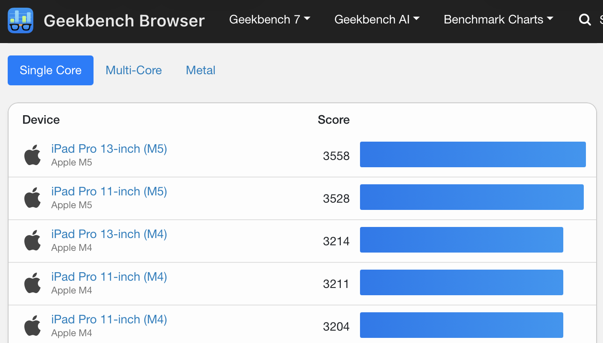

* [Tom's Hardware: Apple's A20 Pro shatters Geekbench 7 single-core record](https://www.tomshardware.com/pc-components/cpus/apples-a20-pro-shatters-geekbench-7-single-core-record-2nm-chip-beats-desktop-intel-core-i9-and-amd-ryzen-9-by-up-to-32-percent)

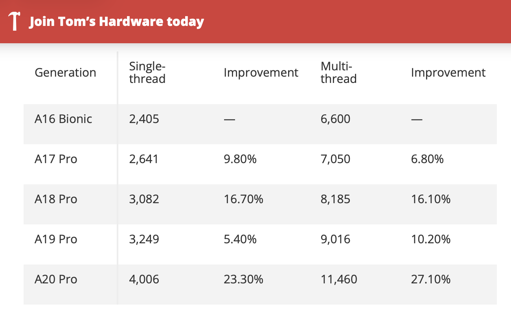

AI/LLM leaderboards have become a ubiquitous feature of the AI arms race. These leaderboards synthesize LLM performance across diverse benchmarks to provide a holistic view of highly variable performance (sound familiar?). There are a number of these leaderboards, but a few good examples are:

* [Terminal-Bench leaderboard](https://hub.harborframework.com/datasets/terminal-bench/terminal-bench/latest?tab=leaderboard&leaderboard=4-0-0)

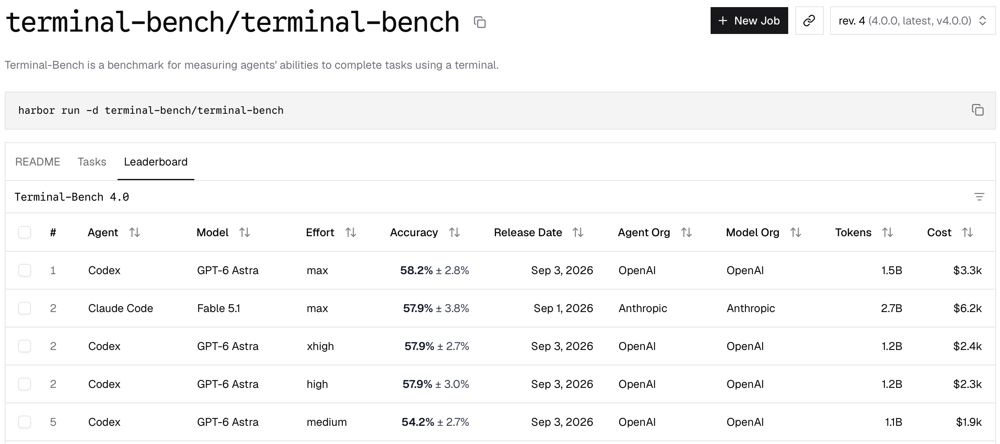

* [Arena text leaderboard: Pareto frontier](https://arena.ai/leaderboard/text/pareto)

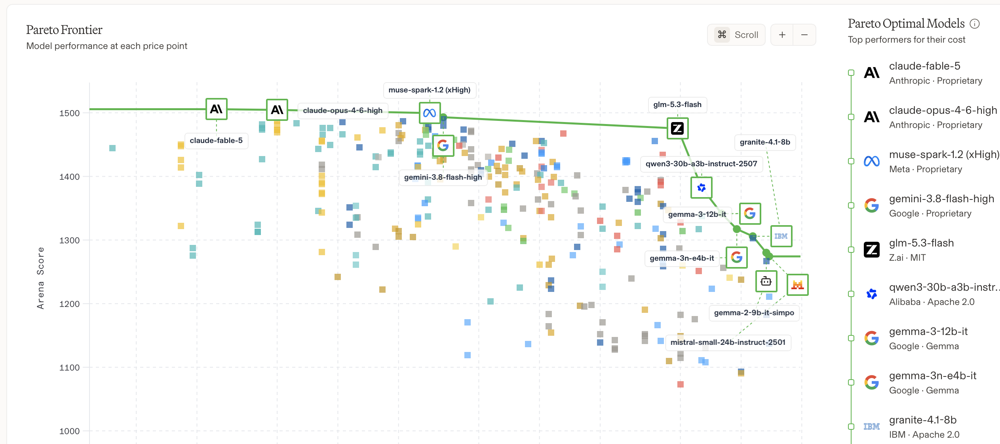

* [LLM Stats](https://llm-stats.com/)

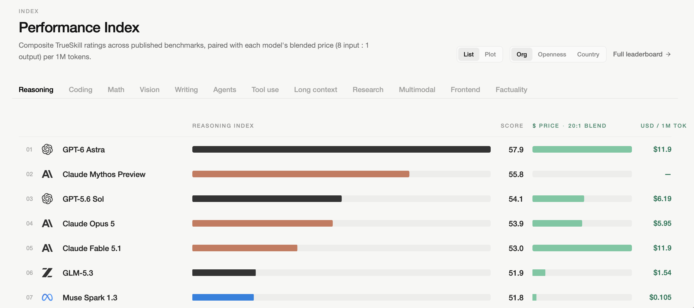

* [Scale Labs agentic leaderboards](https://labs.scale.com/leaderboard?category=agentic)

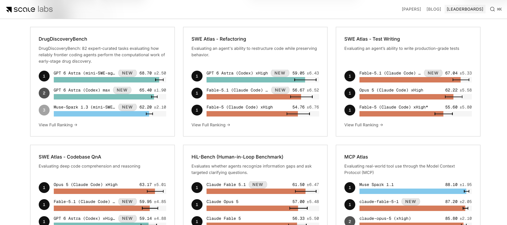

---

## Trust model

BenchBox result publication relies on a trust model using hashed outputs and consistent machine IDs.

* Machine ID is generated and reused consistently so runs from the same hardware can be compared.
* A result integrity hash is calculated when a run completes. It validates that the result has not been modified.
* Result submissions go through a GitHub PR review by BenchBox maintainers before public release.

To provide reproducible results, BenchBox result "bundles" include all of the details necessary to interpret and (if needed) reproduce and validate the benchmarking. Bundles specify:

1. **Hardware used**: CPU type/name, physical/logical cores, total RAM, OS kernel, and client-to-engine locality
2. **BenchBox version**: Git commit hash and release version
3. **Platform version**: DuckDB v2.0.0-preview, DataFusion 46.0, ClickHouse 24.8, etc.
4. **Benchmark configuration**: Scale factor, execution phase, memory limits, thread pools, and optimizer flags

To support public sharing of results, BenchBox v0.4.0 improved the bundle output with additional details:

1. **Run Validation**: Per-query checksums, row counts, and schema validation against known references.
2. **Run Provenance**: User type (maintainer, vendor, or community) and funding (employer, personal, free-trial, grant, vendor-sponsored).

---

## Walkthrough

The Explorer has six tabs: Overview, Benchmarks, Platforms, Compare, Find runs, and Open local result. Each one answers a single question.

### 1. Overview

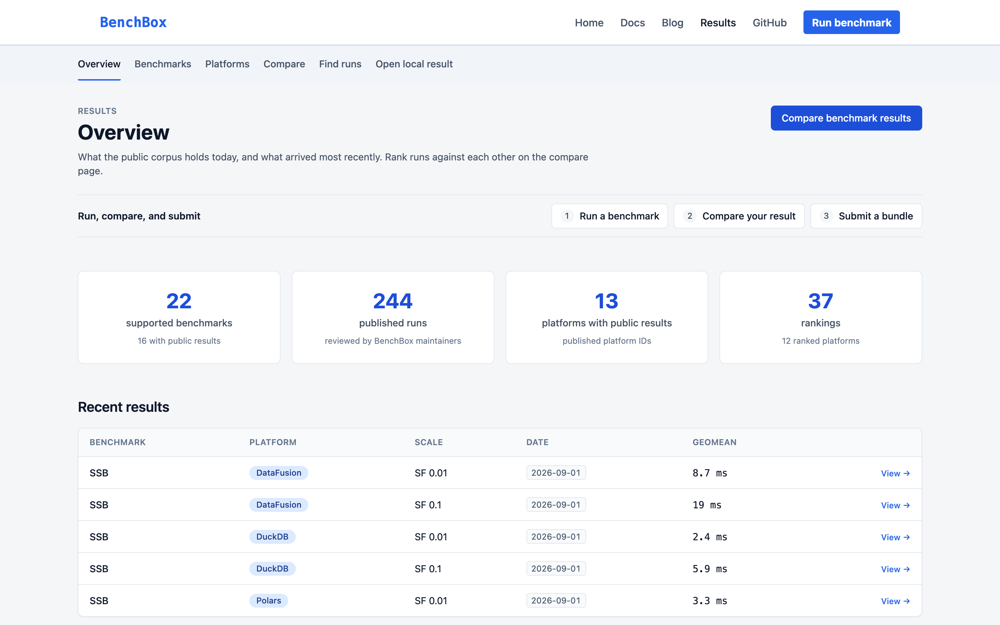

Overview (`/results/`) answers the first question anyone asks: what's here, and what's new? You don't need to set a filter. Four counts sit at the top: supported benchmarks, published runs, platforms, and rankings. As of this post, that's 244 published runs across 13 platforms. Below the counts, Recent results lists the latest arrivals, and three numbered shortcuts take you from running a benchmark to comparing your result to submitting a bundle.

### 2. Platforms

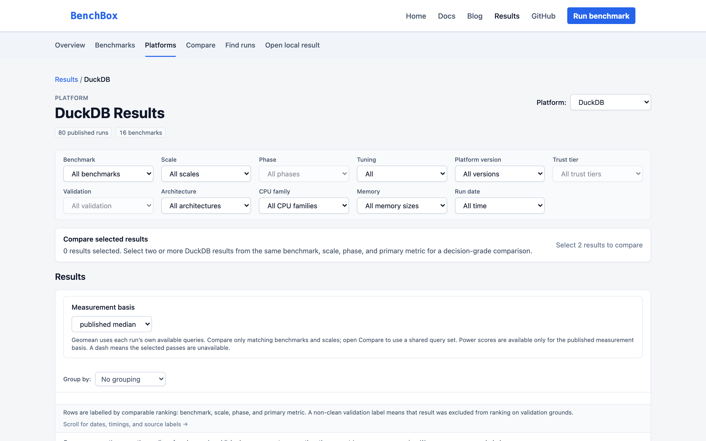

Platforms (`/results/platforms/` and `/results/p/:platform/`) follows one engine across every workload it has run. It's also where version history lives: did a release get faster, or did it regress? DuckDB has the longest record so far, with 80 runs spanning seven versions from 1.0.0 to a 2.0.0 alpha. Architecture, CPU family, and memory filters let you line up versions on similar hardware, when the runs record it.

The measurement basis decides which timings you see. Choose all warm passes, the warmup pass alone, or a single named warm pass, then reduce each query's timings by median or min. Whole-run wall-clock totals appear for context only, and there is no CPU-time basis.

### 3. Benchmarks

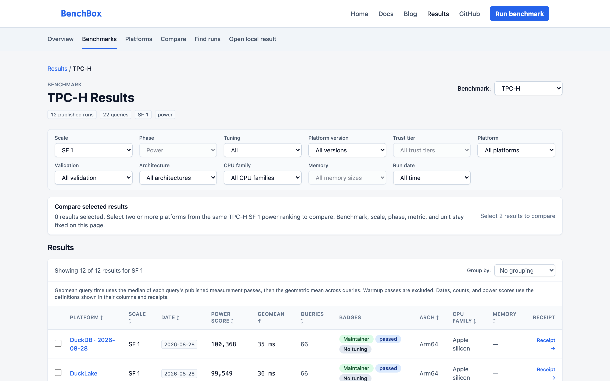

Benchmarks (`/results/benchmarks/` and `/results/:benchmark/`) organizes results by workload, because performance depends on the queries, the schema, and the data size. Every ranking holds one scale factor and one test phase. Scale factor (SF) sets the data size; for TPC-H, SF 1 is about 1 GB. That rule keeps an SF 1 run from ever ranking against an SF 10 run. Badges on each row show trust tier, validation status, and tuning. Tick two or more rows to open them in Compare, or open the per-query matrix to see whether a lead holds across queries or rests on one outlier.

### 4. Compare

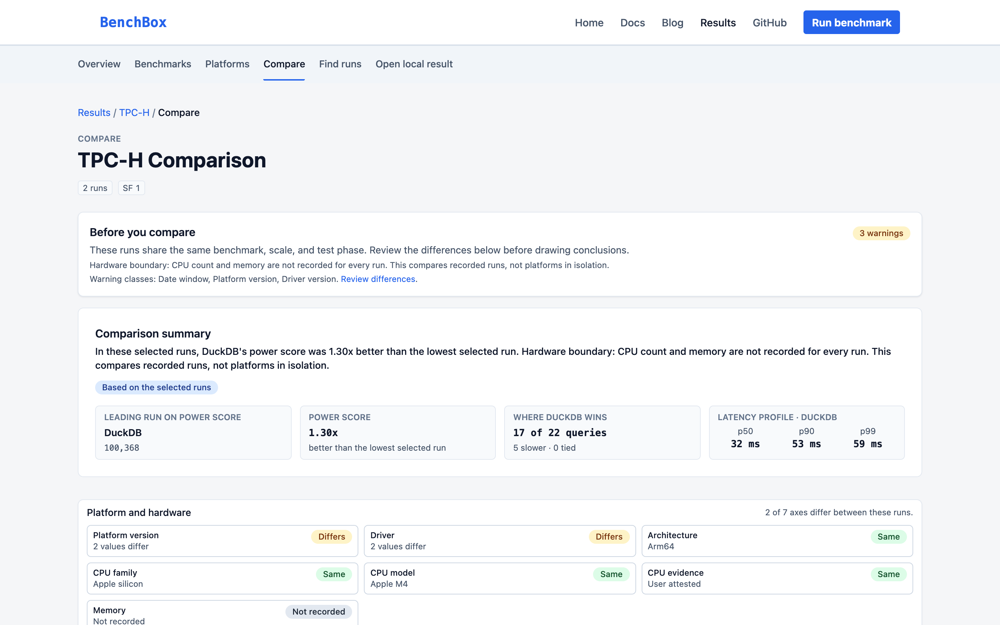

Compare (`/results/compare?ids=...`) puts up to four runs side by side. The screenshot above shows [DuckDB 1.3.2 and DataFusion 53.0.0 on TPC-H SF 1](https://benchbox.dev/results/compare?ids=103f8e02,15e9b720). Before it shows any numbers, a "Before you compare" panel confirms the runs share a benchmark, scale factor, and phase, then lists every other difference as a warning. This pair carries three: date window, platform version, and driver version.

The Comparison summary comes next. In these runs, DuckDB's power score (higher is better) was 1.30x the lower run's, and DuckDB was faster on 17 of 22 queries. The summary also shows p50, p90, and p99 latency, and a Platform and hardware panel marks which details differ and which were never recorded. When runs don't share a scale factor, Compare still shows the evidence but won't name a winner:


### 5. Find runs

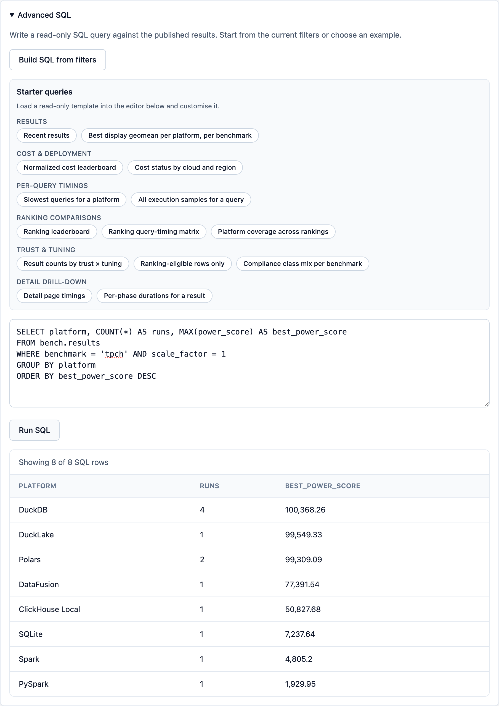

Find runs (`/results/query`) does two jobs. The first is search: filter by benchmark and platform, or search by platform, version, or public ID, then select up to four runs to compare. The second is SQL, for questions the built-in views don't answer. Open Advanced SQL, load a starter query or build one from your current filters, and run it. Your browser does the work. DuckDB-WASM queries a static `results.duckdb` file, with no backend involved. When you're done, download the filtered rows as CSV or JSON.

### 6. Open local result

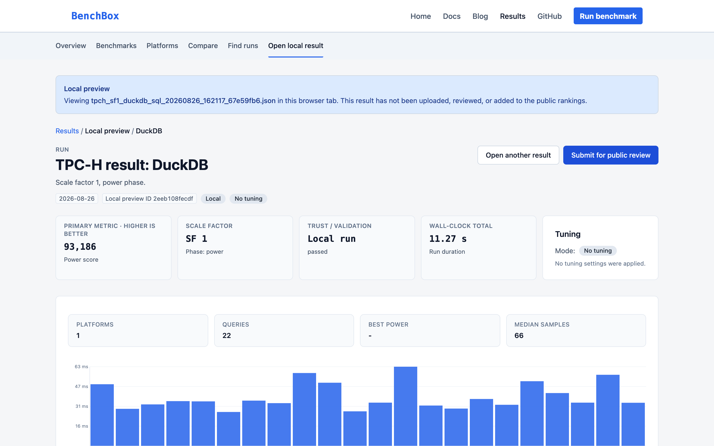

Open local result (`/results/local`) answers the question every contributor has before sharing: how does my run look? Pick a result JSON file and the Explorer parses it in your browser. Nothing is uploaded, and a banner says so. Your run gets the same cards, tables, and charts as a public result.

It's a preview, though. The Explorer checks the file's shape, derives timings, and shows the validation status the run recorded. It doesn't re-verify checksums, classify tuning, or decide whether the run can be submitted. `benchbox submit` does that, and the Submit for public review button links to the guide that walks you through it.

---

## How it works

- No backend
- Static site on GitHub Pages
- Queries run in your browser via DuckDB-WASM
- Fast, cheap, can't go down

---

## Contribute in 3 steps

1. Run a benchmark

   ```bash
   uv run -- benchbox run --platform duckdb --benchmark tpch --scale 1
   ```

2. Package with `benchbox submit`

   - Set one stable, private salt
   - Reuse it for every submission

   ```bash
   export BENCHBOX_MACHINE_ID_SALT="<stable-private-random-value>"
   uv run -- benchbox submit --last --output ./submission
   ```

3. Open a PR against `published-results`

   - Fork [BenchBox-dev/BenchBox](https://github.com/BenchBox-dev/BenchBox)
   - Copy `submission/bundle/` and the manifest into `results-data/bundles/`
   - Regenerate the inventory: `uv run -- python scripts/generate_corpus_inventory.py --write`
   - Maintainers review before anything goes public

Full details: [Contributing Benchmark Results](https://benchbox.dev/docs/contributing-results.html)

---

## Next steps

- Explore the data: [benchbox.dev/results](https://benchbox.dev/results/)
- Inspect your own runs: **Open local result**
- Contribute one back: `benchbox submit`, then a PR

---

## References

1. [BenchBox Results Explorer](https://benchbox.dev/results/)
2. [Geekbench Browser: iOS benchmarks](https://browser.geekbench.com/ios-benchmarks)
3. [Tom's Hardware: Apple's A20 Pro shatters Geekbench 7 single-core record](https://www.tomshardware.com/pc-components/cpus/apples-a20-pro-shatters-geekbench-7-single-core-record-2nm-chip-beats-desktop-intel-core-i9-and-amd-ryzen-9-by-up-to-32-percent)
4. [Terminal-Bench leaderboard](https://hub.harborframework.com/datasets/terminal-bench/terminal-bench/latest?tab=leaderboard&leaderboard=4-0-0)
5. [Arena text leaderboard: Pareto frontier](https://arena.ai/leaderboard/text/pareto)
6. [LLM Stats](https://llm-stats.com/)
7. [Scale Labs agentic leaderboards](https://labs.scale.com/leaderboard?category=agentic)
8. [Contributing Benchmark Results](https://benchbox.dev/docs/contributing-results.html)
