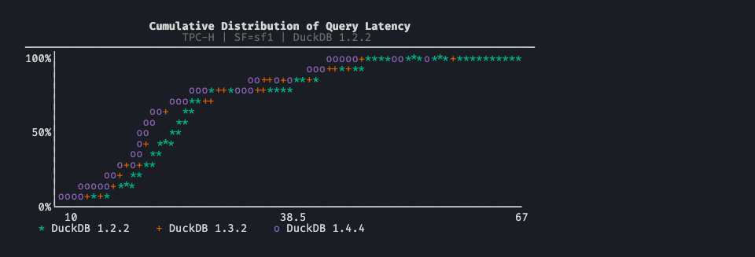

# BenchBox v0.2.0: Alpha to Beta

> BenchBox v0.2.0 moves the project to Beta by pairing a higher release-quality bar with broader cloud-platform hardening.

**TL;DR**: BenchBox v0.2.0 moves the project to Beta after raising the coverage threshold to 80%, hardening Redshift across provisioned and Serverless deployments, and adding live tests on five cloud platforms. It also makes validation work on fresh installs with on-demand TPC answer downloads and closes reliability gaps in Dask and BigQuery.

---

BenchBox v0.2.0 was released on **April 1, 2026**.

This release promotes BenchBox from Alpha to Beta. The Alpha releases built out the feature surface; v0.2.0 is where we started hardening the core path across environments we don't directly control and preparing the project for broader adoption.



## Release highlights

- **Project status promoted to Beta.** BenchBox is now `Development Status :: 4 - Beta` in package metadata. APIs are stabilizing.
- **Coverage threshold raised to 80%** with behavioral tests across adapters, CLI, credentials, and lifecycle paths.
- **On-demand TPC answer file downloads.** Validation works on fresh installs without manual answer-file setup. Offline environments can pre-populate with `benchbox download-answers`.
- **Redshift support hardened across provisioned and Serverless deployments.** Adaptive connection timeouts, deployment-aware system queries, and more reliable S3 data loading. Read Primitives coverage expanded from 0 to 40+ queries.
- **Cloud platform live tests** for Firebolt, Starburst Galaxy, MotherDuck, pg_duckdb, and pg_mooncake, with Docker Compose harness for PostgreSQL extension comparison.
- **Dask DataFrame coverage expanded** for TPC-H and TPC-DS by fixing 11 `.isin()` runtime failures.
- **BigQuery parquet-first native loads** and standardized format defaults across SQL platforms.
- Two platforms removed; legacy `benchbox plot` replaced by `benchbox visualize`.

## At a glance

| Area                 | What changed in v0.2.0                                                                               | Why it matters                                                                       |
| -------------------- | ---------------------------------------------------------------------------------------------------- | ------------------------------------------------------------------------------------ |
| Beta status          | `Development Status :: 4 - Beta`                                                                     | APIs are stabilizing; project is ready for broader adoption                          |
| Coverage hardening   | Threshold raised to 80%; behavioral tests across adapters and CLI                                    | Higher confidence in every release going forward                                     |
| TPC answer downloads | Auto-fetch for wheel installs; `benchbox download-answers` for offline                               | Validation works on fresh installs, including air-gapped prep workflows              |
| Redshift platform    | Adaptive timeouts, deployment-aware system queries, reliable S3 loading, 40+ Read Primitives queries | Redshift benchmarking is more reliable across provisioned and Serverless deployments |
| Cloud live tests     | Firebolt, Starburst Galaxy, MotherDuck, pg_duckdb, pg_mooncake                                       | Regressions caught on real platforms before release                                  |
| Dask DataFrame       | `.isin()` materialization for 11 affected TPC-H/TPC-DS queries                                       | Removes a specific class of Dask runtime failures in TPC benchmarks                  |
| BigQuery loading     | Parquet-first native loads; standardized format defaults                                             | Faster, more reliable BigQuery benchmarking                                          |
| Platform focus       | Snowpark Connect, Onehouse Quanton removed (31 to 29)                                                | Resources focused on platforms with active usage and testing                         |

## What "Beta" means for BenchBox

The `Development Status` classifier in `pyproject.toml` moved from `3 - Alpha` to `4 - Beta`. This is the metadata PyPI surfaces when users evaluate whether to depend on a package.

**What it means in practice:**

- Core APIs (CLI flags, Python API, result JSON format) are stabilizing. We will avoid breaking changes where possible and document them when necessary.
- The benchmark pipeline (data generation, loading, query execution, validation, result export) has been exercised across enough platforms and scale factors that we're confident in the core path.
- We still don't recommend BenchBox for unattended production pipelines. Beta means the main path works reliably; edge cases may still surface.

**What drove the decision:** the work across v0.1.x built out the feature surface. DataFrame coverage landed in v0.1.2. Chart rendering matured across v0.1.3-v0.1.4. Driver management and optional extras shipped in v0.1.3. Test quality replaced coverage theater in v0.1.5.

v0.2.0 adds the remaining pieces we wanted before the label change: cloud platform hardening, live integration tests against real services, an 80% coverage threshold, and a much more reliable Redshift path across provisioned and Serverless deployments. The Beta label reflects the cumulative state of the project, not a single feature.

## What changed for typical workflows

### 1. On-demand TPC answer file downloads

TPC-H and TPC-DS answer files (used for row-count validation) are not included in the wheel distribution. Previously, users installing BenchBox from PyPI had to manually source these files before validation would work.

Now, wheel installs detect missing answer files at validation time and fetch them automatically. Each download is verified with SHA-256 checksums, and retries handle transient network failures.

For air-gapped or restricted environments:

```bash
# Pre-populate the answer file cache on a machine with access
benchbox download-answers --benchmark tpch
benchbox download-answers --benchmark tpcds
benchbox download-answers --benchmark all     # both at once

# Check where cached files are stored
benchbox download-answers --show-cache-dir

# Disable auto-download entirely
export BENCHBOX_NO_DOWNLOAD=1
```

The `--force` flag re-downloads even if cached files exist, useful after an answer file update.

### 2. Redshift support hardened across provisioned and Serverless deployments

Redshift received the most attention in this release. The goal was to make Redshift benchmarking more reliable across provisioned and Serverless deployments.

For provisioned clusters, BenchBox now checks cluster state through the AWS API and extends connection timeouts when a cluster is paused, resuming, or rebooting. Serverless does not expose the same compute-warmth state, so BenchBox uses a longer fixed timeout floor there to cover cold starts.

Deployment-specific system queries now adapt automatically: provisioned clusters use `stv_cluster_configuration` and `procpid`; Serverless uses `sys_serverless_usage` and `pid`.

We also fixed a cluster of reliability problems around data loading and admin operations: botocore stream rewind errors that broke S3 upload retries, long `DROP DATABASE` operations that needed a 300 second floor plus active connection termination, stale native datagen reuse, and mixed-format manifest handling. Platform format preferences now take priority over manifest defaults for native COPY loads.

Non-admin Redshift connections now work through validation and benchmark execution, which matters in organizations where benchmark operators do not have cluster-management permissions. Read Primitives coverage also expanded from 0 to 40+ queries with dialect-specific rewrites. Queries without an exact Redshift equivalent are skipped rather than approximated.

### 3. Cloud platform live integration tests

Cloud platforms were previously tested only through mocked adapter paths. Real-platform failures (credential edge cases, API changes, timeout behavior) only surfaced during manual testing.

We now run live smoke tests against Firebolt, Starburst Galaxy, MotherDuck, pg_duckdb, and pg_mooncake. Each platform has a dedicated pytest marker, fixture set, and Makefile target. PostgreSQL extensions (pg_duckdb, pg_mooncake) use a Docker Compose harness that stands up isolated instances with extensions installed.

A multi-extension comparison orchestration layer runs the same benchmark across multiple PostgreSQL extensions in a single invocation, useful for comparing analytical extensions on identical workloads.

### 4. Dask DataFrame coverage expanded

Six TPC-H queries (Q4, Q16, Q18, Q20, Q21, Q22) and five TPC-DS queries (Q37, Q41, Q45, Q82, Q83) were passing lazy Dask Series objects to `.isin()`, causing `TypeError` at runtime. Those call sites now materialize via `.compute()` before the `.isin()` call.

This closes a specific class of Dask runtime failures in TPC-H and TPC-DS and makes those benchmark paths more reliable. It does not change the broader maturity gap between Dask and the production-ready DataFrame adapters.

### 5. BigQuery parquet-first native loads

We standardized text files (`.tbl`) as the default load source for SQL platforms while preserving columnar preferences for catalog platforms. BigQuery specifically gained parquet-first native loads, which avoids the overhead of text-to-columnar conversion at load time.

A related improvement corrected GCS blob naming for compound suffixes (`.parquet.zst` was being truncated to `.zst`), ensuring compressed parquet files load correctly.

## Release-quality hardening

**Coverage threshold:** raised from 60% (set in v0.1.5) to 80%. This required adding behavioral test coverage across adapter SQL generation, CLI command paths, credential prompt flows, and adapter lifecycle (connect, execute, disconnect). The threshold applies to `coverage-fast` runs, which now use parallel execution for faster CI feedback.

**Dead code cleanup:** we removed 9 unused platform imports and prefixed 12 unused function parameters with `_` across the adapter layer. These were identified during the coverage push and Beta readiness audit.

**Test quality:** tautological assertions (tests asserting on a mock's own return value) and overspecified mocks were replaced with tests that exercise real behavior. This continues the direction from v0.1.5 where we deleted 13 hollow test files and added mutation testing.

## Other improvements

- **Data-source database resolution:** shared-data benchmarks (Read Primitives and others) now resolve the source benchmark's database name correctly, eliminating silent failures in multi-benchmark workflows.
- **TPC-H validation output:** non-stream-0 power runs no longer emit spurious "Validation skipped" warnings on every measurement iteration, keeping output clean during long runs.
- **Monitoring without extras:** benchmark execution and progress reporting degrade gracefully when the monitoring optional extra is not installed.
- **`benchbox plot` replaced by `benchbox visualize`:** the legacy plot command and its undeclared matplotlib dependency are removed. `benchbox visualize` (terminal ASCII rendering) has been available since v0.1.2.
- **Platform list focused:** Snowpark Connect and Onehouse Quanton removed from the SQL platform list (31 to 29). Neither had active adapter maintenance. If you need either re-added, open an issue with your use case.

## Changed behavior to be aware of

- **Validation auto-downloads answer files.** If your environment blocks outbound HTTP, set `BENCHBOX_NO_DOWNLOAD=1` and use `benchbox download-answers` on a machine with network access.
- **Redshift format selection.** Platform preferences now take priority over manifest preferences for COPY loads. This may change format selection in mixed-format environments.
- **`benchbox plot` is gone.** Scripts calling it will get a "No such command" error. Use `benchbox visualize`.
- **Two SQL platforms removed.** `--platform snowpark-connect` and `--platform onehouse-quanton` are no longer valid.

## Quick upgrade checks

After upgrading to v0.2.0:

1. Confirm installed version:

```bash
benchbox --version
```

2. Run a smoke benchmark and confirm validation completes (answer files download automatically):

```bash
benchbox run --platform duckdb --benchmark tpch --scale 0.01 --phases power --non-interactive
```

3. If using Redshift, verify connection succeeds without manual timeout configuration:

```bash
benchbox run --platform redshift --benchmark tpch --scale 0.01 --dry-run ./preview
```

4. If your automation still calls `benchbox plot`, update it and confirm the replacement command is available:

```bash
benchbox visualize --help
```

5. If you benchmarked Snowpark Connect or Onehouse Quanton, update those automation paths before the next run. Both platform names were removed from the supported SQL platform list in v0.2.0.

## Bottom line

The Alpha series built the feature surface: 18 benchmarks, broader DataFrame coverage, 15 ASCII chart types, driver version pinning, table format loading, and a standalone textcharts library. v0.2.0 shifts the focus from adding capabilities to hardening the core path.

The numbers behind the Beta decision: 80% test coverage (up from 60%), 40+ Redshift dialect rewrites, 5 cloud platforms with live integration tests, and answer file validation that works on a fresh wheel install. Provisioned Redshift clusters now get state-aware timeouts, and Serverless deployments get a longer cold-start floor.

This is the foundation for what comes next. With the core pipeline more stable and tested against real cloud services, we can spend upcoming releases on the features users have been asking for and the infrastructure that makes those features safe to ship.

If you run into anything unexpected after upgrading, open an issue and we'll take a look.

---

## Reference

- Changelog entry: `CHANGELOG.md` (`[0.2.0] - 2026-04-01`)
- Previous release posts: [v0.1.5](07-v0-1-5-release-summary.md), [v0.1.4](04-v0-1-4-release-summary.md), [v0.1.3](03-v0-1-3-release-summary.md)
