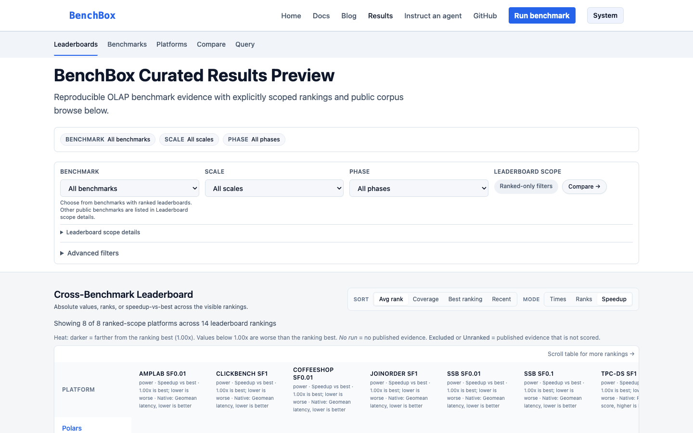

# BenchBox v0.4.0: new org, DuckLake, and result provenance

**TL;DR**: BenchBox now lives at [`BenchBox-dev/BenchBox`](https://github.com/BenchBox-dev/BenchBox). Published results can record who ran them and who paid, including a new `vendor-supplied` trust label, and the Results Explorer preview at [benchbox.dev/results/](https://benchbox.dev/results/) displays those fields. DuckLake lands as a beta platform. The bare `clickhouse` alias and the `databricks-connect` extra are gone; Throughput@Size figures from earlier releases need a rerun, not a re-export.

---



BenchBox v0.4.0 was released on **August 28, 2026**.

The headline change is the move to its own GitHub organization. The repository name, the PyPI project `benchbox`, and `benchbox.dev` are unchanged, and old remotes keep redirecting. The project now lives in an organization account.

The second change is a vocabulary for published results: who produced a run, its trust label, and disclosed funding. The Results Explorer at [benchbox.dev/results/](https://benchbox.dev/results/) has been reachable since April 2026; this tagged release is the first that names that preview and shows those labels on it. An organization account and labels for who produced a result are both prerequisites for results from other people.

The third is DuckLake as `--platform ducklake`, still beta: Parquet table data with catalog metadata in a SQL database, and catalog backend and data path chosen independently.

## At a glance

| Area | What changed in v0.4.0 | Why it matters |
| --- | --- | --- |
| Project home | Repository moved to `github.com/BenchBox-dev/BenchBox` | Org-owned home; old links redirect; install command unchanged |
| Provenance and funding | Source, trust label, and funding recorded, including `vendor-supplied` | A published number can say who ran it and who paid |
| Results Explorer | Preview at `benchbox.dev/results/` now shows those labels | Reachable since April 2026; this release names the preview |
| DuckLake (beta) | `--platform ducklake` with independent catalog and data path | Four documented modes validated at TPC-H SF1 |
| MCP transport | `benchbox-mcp --transport streamable-http` | Extra local path; stdio unchanged; hosted use unsupported |
| TPC throughput | Throughput@Size counts every executed query | Corrects 22x (TPC-H) and 99x (TPC-DS) understatements |
| TPC generators | Bundled tools are probed; source build if the loader refuses them | Unblocks generation on macOS 15 and earlier Apple Silicon |
| Removals | Bare `clickhouse` alias and `databricks-connect` extra | Pre-announced shims with named replacements |

## A new home: BenchBox-dev

The repository, issue and release tooling, CI, and package metadata now point at [`github.com/BenchBox-dev/BenchBox`](https://github.com/BenchBox-dev/BenchBox). Existing remotes that still use `github.com/joeharris76/BenchBox.git` keep redirecting, so updating a local remote is useful but not urgent:

```bash
git remote set-url origin https://github.com/BenchBox-dev/BenchBox.git
```

The repository name, PyPI project, domain, and `uv add benchbox` command stay the same. This is an ownership and namespace move.

## Provenance labels, and where to see them

v0.4.0 adds a canonical vocabulary for result source, trust label, and funding, plus a `benchbox run --funding` flag and an optional provenance block in result bundles. The `vendor-supplied` trust label is new. The preview at [benchbox.dev/results/](https://benchbox.dev/results/) displays those fields in rankings, comparisons, and result details.

Ranked tables include maintainer-run, CI, and vendor-supplied results. Community submissions stay visible and are not ranked. The vendor label cannot be self-applied: it is derived from bundles under `results-data/bundles/vendor/`, and submission CI rejects non-maintainer PRs that touch that path. In the August 28 preview snapshot, all 138 rows are `maintainer-run` with funding `unspecified`.

Accepted `--funding` values are `employer`, `personal`, `free-trial`, `vendor-sponsored`, `grant`, and `unspecified` (the default). Eligibility gates, the comparability receipt, and corpus curation belong in the companion post.

## DuckLake beta

DuckLake stores table data as Parquet while keeping catalog metadata in a SQL database. BenchBox now runs it with `--platform ducklake`. Catalog backend and data path are independent choices, so `catalog=duckdb|sqlite|postgres` composes with a local or `s3://` `data_path`. That is six possible combinations.

Four of those six passed TPC-H scale-factor-1 correctness validation: `local`, `local_catalog_s3`, `postgres_catalog`, and `postgres_catalog_s3`. SQLite catalogs are a supported option, not one of those four validated modes. We are keeping the beta label rather than extrapolating those four runs to every combination, scale, and benchmark.

DuckLake requires DuckDB 1.3 or later. The first run also needs network access to `INSTALL` the DuckLake extension. Install and try the local path with:

```bash
uv add "benchbox[ducklake]"
uv run -- benchbox run --platform ducklake --benchmark tpch --scale 0.01
```

A PostgreSQL catalog with S3-backed Parquet data uses the same command with extra platform options. Postgres plus S3 is one of the four SF1-validated modes; this snippet is the flag shape:

```bash
uv run -- benchbox run --platform ducklake --benchmark tpch --scale 0.01 \
  --platform-option catalog=postgres \
  --platform-option data_path=s3://bucket/prefix/
```

BenchBox reuses an existing catalog by default. `--force` rebuilds catalog state and local data, but it does not recursively delete an S3 data prefix.

## Corrections worth knowing

**TPC throughput was understated.** Throughput@Size now includes every executed query, correcting 22x (TPC-H) and 99x (TPC-DS) understatements in earlier result versions. Historical bundles are left unchanged as records of what those versions produced. Re-exporting an old bundle does not fix the number, because the exporter reuses a stored `throughput_at_size` when one is present. If you published a Throughput@Size figure from an earlier release, rerun the benchmark on v0.4.0.

**`BENCHBOX_TUNING_ENABLED` never worked.** It set a config key nothing read at runtime, and the docs claimed it activated tuned runs in CI. Use `--tuning tuned` or `--tuning auto`; `BENCHBOX_TUNING_CONFIG` still works. If you set the old variable, delete it.

**`--tuning auto` on SQL platforms is constraints-only.** Primary-key, foreign-key, unique, and check constraints, and nothing else. DataFrame platforms keep their smart defaults. This documentation update describes the constraints `--tuning auto` already applied on SQL platforms.

## Other notable changes

- Local MCP clients can use `benchbox-mcp --transport streamable-http`; existing stdio integrations are unchanged. Authenticated non-local deployments support persistent jobs, but shared production deployment remains deferred and unsupported.
- BenchBox now probes a bundled TPC generator before selecting it and compiles from source when the loader refuses it. That unblocks TPC-H data generation on macOS 15 and earlier Apple Silicon. The shipped darwin-arm64 binaries still target a newer OS (`minos 26.0`); the fallback is a slower first run, not a rebuilt binary.
- Secret redaction now covers more DuckLake, MotherDuck, export, and MCP paths. Backend-provided exception text can still repeat values, so credentials should not be placed in values a backend may echo.
- Write and Transaction Primitives now detect staged data from the wrong scale factor and rebuild it automatically.

## Changed behavior to be aware of

| Previous use | v0.4.0 action |
| --- | --- |
| `--platform clickhouse` | Choose `clickhouse-local`, `clickhouse-server`, or `clickhouse-cloud`; `clickhouse:local` / `:server` / `:cloud` also work |
| `get_adapter("clickhouse")` | Same three names |
| `ch` shorthand | No change required; it now selects `clickhouse-local` |
| `benchbox[databricks-connect]` | Use `benchbox[cloud-spark-databricks]` |
| Earlier TPC-H or TPC-DS Throughput@Size | Rerun with v0.4.0; re-exporting preserves the stored metric |

The ClickHouse alias was added in v0.2.1 as a deprecation shim and removed on schedule. Passing bare `clickhouse` now raises a `ValueError` that names the replacements, rather than silently picking a deployment mode. The Databricks change renames only the BenchBox extra; it still installs the upstream `databricks-connect` package.

## Try it yourself

After upgrading to v0.4.0:

1. Confirm the installed version:

```bash
benchbox --version
```

2. Run a smoke benchmark with an explicit funding disclosure:

```bash
uv add "benchbox[duckdb]"
uv run -- benchbox run --platform duckdb --benchmark tpch --scale 0.01 \
  --funding personal --non-interactive
```

3. If you used the bare ClickHouse selector, confirm a named deployment mode:

```bash
uv run -- benchbox run --platform clickhouse-local --benchmark tpch --scale 0.01 \
  --dry-run ./preview
```

4. Try the local DuckLake path:

```bash
uv add "benchbox[ducklake]"
uv run -- benchbox run --platform ducklake --benchmark tpch --scale 0.01
```

5. Browse the Results Explorer preview at [benchbox.dev/results/](https://benchbox.dev/results/).

v0.4.0 was a maintainer-driven cycle. If a result, label, or migration note needs correction, [start a discussion](https://github.com/BenchBox-dev/BenchBox/discussions).

---

## References

- Changelog entry: `CHANGELOG.md` (`[0.4.0] - 2026-08-27`)
- Release tag: [v0.4.0](https://github.com/BenchBox-dev/BenchBox/releases/tag/v0.4.0)
- DuckLake platform documentation: `docs/platforms/ducklake.md`
- Provenance vocabulary: `benchbox/core/results/provenance.py`
- MCP server reference: `docs/reference/mcp.md`
