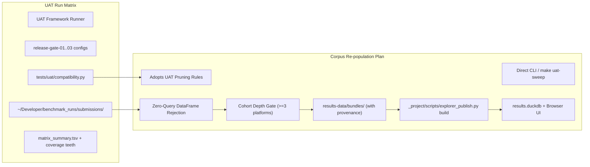
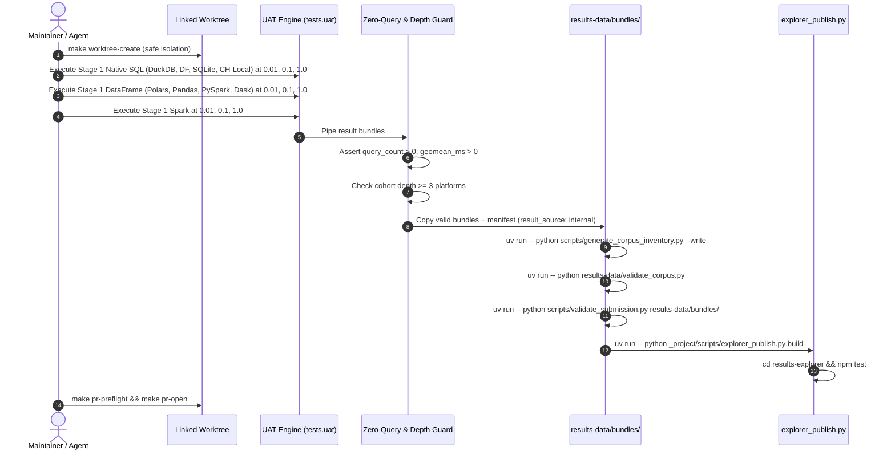

# Plan: Re-populating the Results Explorer Corpus

## 1. Executive Summary & Context

The BenchBox **Results Explorer** (`https://benchbox.dev/results/`) is powered by a curated corpus of schema-v2 result bundles stored in `results-data/bundles/`, indexed in `results-data/corpus-inventory.json`, and compiled into a queryable DuckDB-WASM snapshot (`results.duckdb`) via `_project/scripts/explorer_publish.py build`.

### Current Corpus State & Why Re-population is Needed
Following two necessary quality and soundness interventions, the checked-in corpus currently contains only **138 bundles across 34 cohorts**:
1. **2026-07-16 Tuned Bundle Purge** ([REGENERATION.md](file:///Users/joe/Developer/BenchBox/results-data/REGENERATION.md)): 325 bundles claiming `tuning_mode: tuned` were removed after discovery that CLI direct runs did not propagate tuning configurations to platform adapters.
2. **2026-08-24 Zero-Query DataFrame Withdrawal** ([CORPUS_NOTES.md](file:///Users/joe/Developer/BenchBox/results-data/CORPUS_NOTES.md)): 60 legacy DataFrame bundles were withdrawn because they falsely reported `summary.validation=passed` despite executing zero queries. To preserve the corpus invariant of $\ge 3$ platforms per cohort, 17 accompanying SQL bundles were also temporarily withdrawn (affecting AMPLab, CoffeeShop, H2O-DB, SSB, and TSBS DevOps).
3. **Current Platform Under-representation**: While platforms like DataFusion (48 bundles) and Spark (19 bundles) have coverage, **ClickHouse Local (`chdb`)** has only 1 bundle, **DuckDB** has only 18, **Pandas (`pandas-df`)** has 0, and **Dask (`dask-df`)** has 0, despite all being ready and installed locally.

This plan details the end-to-end execution to re-populate `results-data/bundles/` with truthful, validated, small scale factor baseline runs across all locally runnable platforms, with **Scale Factor 1.0 (SF1) mandatory** across all platforms capable of running it locally.

---

## 2. The SF1 Mandate: Locally Runnable Platform Scope

**Scale Factor 1.0 (SF1)** represents the standard 1 GB analytical dataset. Running SF1 across all locally capable platforms fulfills two essential goals:
1. Establishes a true 1 GB reference baseline on the public Results Explorer leaderboard.
2. Complements the smoke scales (`0.01` and `0.1`) to enable complete three-point scaling curves (`0.01` $\to$ `0.1` $\to$ `1.0`) in the Explorer cross-scale comparison view.

### Local Platform SF1 Capability Assessment

| Platform | Tier / Type | SF1 Supported Workloads | SF1 Pruning & Runtime Boundaries (per UAT & Registry) |
|---|---|---|---|
| [`duckdb`](file:///Users/joe/Developer/BenchBox/benchbox/platforms/duckdb.py) | Tier 1: Native In-Process SQL | **All benchmarks**: TPC-H, SSB, TPC-H Skew, CoffeeShop, AMPLab, H2ODB, ClickBench, JoinOrder, TPC-DS, Read/Write Primitives | Runs SF1 easily in seconds to minutes; zero daemon overhead |
| [`datafusion`](file:///Users/joe/Developer/BenchBox/benchbox/platforms/datafusion.py) | Tier 1: Native In-Process SQL | TPC-H, SSB, TPC-H Skew, CoffeeShop, AMPLab, H2ODB, ClickBench, TPC-DS, Read Primitives | **Pruned at SF1**: DataVault (query 18 exceeds 16 GiB memory envelope on local hosts); Write Primitives (lacks row-level DML) |
| [`sqlite`](file:///Users/joe/Developer/BenchBox/benchbox/platforms/sqlite.py) | Tier 1: Native In-Process SQL | TPC-H, SSB, TPC-H Skew, CoffeeShop, AMPLab, H2ODB, ClickBench, JoinOrder, Read/Write Primitives | **Pruned at SF1**: TPC-DS & TPC-DS OBT (bind/WAL loader projected at >1390s, exceeding 1200s cell timeout; PR #1904) |
| [`clickhouse-local`](file:///Users/joe/Developer/BenchBox/benchbox/platforms/clickhouse_local.py) | Tier 1: Native In-Process SQL (`chdb`) | TPC-H, SSB, TPC-H Skew, CoffeeShop, AMPLab, H2ODB, ClickBench, JoinOrder, Read Primitives | **Pruned**: AI Primitives, Transaction Primitives, Write Primitives (embedded chDB lacks durable staging DML) |
| [`polars-df`](file:///Users/joe/Developer/BenchBox/benchbox/platforms/polars_platform.py) | Tier 2: Native DataFrame | TPC-H, SSB, TPC-H Skew, CoffeeShop, AMPLab, H2ODB, ClickBench, Read Primitives, Write Primitives | **Pruned**: SQL-only benchmarks (TPC-DS, JoinOrder); Transactional benchmarks (TPC-DI, transactions) |
| `pandas-df` | Tier 2: Native DataFrame | TPC-H, CoffeeShop, AMPLab, H2ODB, ClickBench, Read Primitives, Write Primitives | Same DataFrame boundaries; runs SF1 in-memory cleanly |
| `pyspark-df` | Tier 2: Native DataFrame | TPC-H, CoffeeShop, AMPLab, H2ODB, ClickBench, Read Primitives, Write Primitives | Local Spark worker DataFrame execution |
| `dask-df` | Tier 2: Native DataFrame | TPC-H, CoffeeShop, AMPLab, H2ODB, ClickBench, Read Primitives | **Pruned**: Write Primitives (lacks write manager in `core/write_primitives`) |
| `datafusion-df` | Tier 2: Native DataFrame | TPC-H, CoffeeShop, AMPLab, H2ODB, ClickBench, Read Primitives | Same as Dask; analytical queries supported at SF1 |
| [`spark`](file:///Users/joe/Developer/BenchBox/benchbox/platforms/spark.py) | Tier 3: Local Spark Engine | **All SQL benchmarks**: TPC-H, SSB, TPC-H Skew, CoffeeShop, AMPLab, H2ODB, ClickBench, JoinOrder, TPC-DS | Standard local engine for multi-table analytics at SF1 |
| Docker Non-OLTP (`starrocks`, `clickhouse-server`, `cedardb`, `lakesail`) | Tier 4: Local Containerized via Mocker | TPC-H, SSB, ClickBench, AMPLab, H2ODB, CoffeeShop at SF1 | Supported at SF1 if container stack is brought up sequentially |
| Docker OLTP (`postgresql`, `timescaledb`, `questdb`, `doris`) | Tier 4: Local Containerized via Mocker | *Constrained to SF 0.01 in UAT* | **Pruned at SF1**: Local containerized OLTP databases exceed runtime/memory budgets on SF1 loading/indexing |

---

## 3. Comparison: Plan vs. UAT Run Matrix

The BenchBox **UAT Run Matrix** is defined across [tests/uat/matrix.py](file:///Users/joe/Developer/BenchBox/tests/uat/matrix.py), [tests/uat/compatibility.py](file:///Users/joe/Developer/BenchBox/tests/uat/compatibility.py), [tests/uat/phases/enumerate.py](file:///Users/joe/Developer/BenchBox/tests/uat/phases/enumerate.py), and the three canonical release-gate configs ([release-gate-01](file:///Users/joe/Developer/BenchBox/tests/uat/configs/release-gate-01-native-dataframe.yaml), [release-gate-02](file:///Users/joe/Developer/BenchBox/tests/uat/configs/release-gate-02-docker-nonoltp.yaml), [release-gate-03](file:///Users/joe/Developer/BenchBox/tests/uat/configs/release-gate-03-docker-oltp.yaml)).

Here is how this Corpus Re-population Plan compares directly to the UAT Run Matrix:

### Side-by-Side Comparison



| Dimension | UAT Run Matrix ([tests/uat/](file:///Users/joe/Developer/BenchBox/tests/uat/)) | Corpus Re-population Plan | Alignment & Relationship |
|---|---|---|---|
| **Primary Charter** | Certification & regression testing of harness, adapters, and platform stability across releases. | Publishing curated, permanent result bundles into `results-data/` to power the web Results Explorer. | **Complementary**: The plan can consume UAT execution output directly to populate the corpus. |
| **Platform Scope** | 27 platforms total across 4 groups (`native-sql`, `dataframe`, `docker-fast`, `docker-slow`). | Filters UAT platform groups by **local readiness**: Tiers 1–3 (native SQL, DataFrame, Spark) + verified single-service Mocker stacks. | **Subset**: Omits platforms with missing dependencies (`modin`, `databend`) or unverified Mocker multi-service containers. |
| **Scale Ladders** | `release-gate-01` & `02` use `[0.01, 0.1, 1.0]`. `release-gate-03` (OLTP) uses `[0.01]`. | **Identical**: Mandates SF1 for all locally runnable platforms, with SF 0.01 + 0.1 for multi-scale curve analysis. | **100% Aligned**: Adopts the UAT release-gate scale ladder directly. |
| **Matrix Pruning** | Uses [compatibility.py](file:///Users/joe/Developer/BenchBox/tests/uat/compatibility.py) to prune SQL-only benchmarks for DataFrame, transactional gates, and measured host timeouts (e.g. SQLite TPC-DS SF1, DataFusion DataVault SF1). | **Adopts exact UAT pruning**: Never attempts cells known to timeout or OOM on local hosts. | **100% Aligned**: Reuses UAT's battle-tested compatibility rules. |
| **Cell Accounting** | **Stage 1**: 514 active cells, 212 pruned (192 SF1 cells).<br>**Stage 2**: 215 active cells, 49 pruned (79 SF1 cells).<br>**Stage 3**: 203 active cells (SF 0.01 only). | Focuses on the core analytical & primitive benchmarks ($\approx 8\text{--}10$ benchmarks across 10 native platforms $\times$ 3 scales $\approx 180\text{--}240$ cells). | **Targeted Slice**: Prioritizes high-density, multi-platform comparison cohorts over long-tail edge benchmarks. |
| **Execution Ordering** | Strictly serialized: Native SQL $\to$ DataFrame $\to$ Docker non-OLTP $\to$ Docker OLTP. Proved via lifecycle logs. | Uses the exact same stage-ordered sequencing. | **100% Aligned**: Preserves host performance isolation. |
| **Output Root** | `BENCHBOX_OUTPUT_DIR=~/Developer/benchmark_runs` (external root invariant). | Uses `BENCHBOX_OUTPUT_DIR=~/Developer/benchmark_runs`. | **100% Aligned**: Enforces worktree cleanliness. |
| **Corpus Cohort Depth ($\ge 3$ Platforms)** | Not enforced by UAT directly (UAT allows single-platform cell execution). | **Mandatory Hard Gate** ([validate_corpus.py](file:///Users/joe/Developer/BenchBox/results-data/validate_corpus.py)): Every cohort must have $\ge 3$ platforms. | **Corpus Extension**: Staging will exclude any cohort that does not reach $\ge 3$ platforms. |
| **DataFrame Query Integrity** | UAT detects zero query timings as warnings or execution records. | **Mandatory Rejection**: Discards any DataFrame bundle where `summary.queries.total == 0` or queries are empty. | **Corpus Extension**: Directly guards against the 2026-08-24 regression. |
| **Provenance Sidecars** | UAT package emits `local-stage` manifests with default fields. | **Provenance Normalization**: Sidecars explicitly set `result_source: internal` and `funding: unspecified`. | **Corpus Extension**: Ensures bundles resolve as `maintainer-run` and appear on public leaderboards. |
| **Final Artifacts** | `matrix_summary.tsv`, `validator_rollup.tsv`, `uat_gate_summary.json`. | `results-data/bundles/`, `corpus-inventory.json`, `results.duckdb`. | **Divergence**: UAT closes at test reports; the Plan closes at web-ready corpus and DuckDB WASM build. |

---

## 4. Prior-Decision Reconciliation (`[REVIEW-PLAN-RECON-001]`)

| Document / Decision | Recorded Requirement | Plan Binding |
|---|---|---|
| [results-data/validate_corpus.py](file:///Users/joe/Developer/BenchBox/results-data/validate_corpus.py) | **Cohort Depth Invariant**: Every committed cohort `(benchmark, scale)` MUST have at least 3 distinct platforms. | Every executed benchmark and scale rung is scheduled across $\ge 3$ compatible platforms. No cohort with $< 3$ platforms will be staged. |
| [results-data/SEED_CORPUS_SPEC.md](file:///Users/joe/Developer/BenchBox/results-data/SEED_CORPUS_SPEC.md) | Standard execution phases: `--phases generate,load,power`. Fractional scales for analytical (`0.01`, `0.1`); integer-only for TPC-DS (`1.0`). | Standardized CLI flags: `--phases generate,load,power --compression zstd:9`. |
| [results-data/CORPUS_NOTES.md](file:///Users/joe/Developer/BenchBox/results-data/CORPUS_NOTES.md) | **Zero-Query Guard**: DataFrame bundles require non-zero query execution and measured timing before acceptance. | Staging script rejects any bundle where `summary.queries.total == 0` or query timings are empty. |
| [results-data/README.md](file:///Users/joe/Developer/BenchBox/results-data/README.md) | **Provenance & Trust Label**: Sidecars (`<stem>.manifest.json`) must record `result_source: internal` to derive `maintainer-run`. | Submission staging ensures all manifest sidecars declare `result_source: internal` so runs are ranking-eligible on the public leaderboard. |
| [docs/operations/uat-framework.md](file:///Users/joe/Developer/BenchBox/docs/operations/uat-framework.md) | **External Root & Ordering**: Output must target `BENCHBOX_OUTPUT_DIR=~/Developer/benchmark_runs`. Native SQL $\to$ DataFrame $\to$ Docker. | Execution runs against external directory; native platforms complete before any container stack starts. |
| [AGENTS.md](file:///Users/joe/Developer/BenchBox/AGENTS.md) | Primary clone `/Users/joe/Developer/BenchBox` is read-only. | All work and staging will occur inside a dedicated linked worktree (`make worktree-create`). |

---

## 5. Target Cohort Matrix with SF1 Included

To satisfy both the **SF1 mandate** and the **$\ge 3$ platforms per cohort** rule, the following target matrix will be executed:

| Benchmark | Target Scale Rungs | Platforms Planned ($\ge 3$ per scale rung) | SF1 Eligible Platforms |
|---|---|---|---|
| **TPC-H** (`tpch`) | `0.01`, `0.1`, `1.0` | `duckdb`, `datafusion`, `sqlite`, `clickhouse-local`, `polars-df`, `pandas-df`, `pyspark-df`, `spark` (8 platforms) | All 8 platforms |
| **SSB** (`ssb`) | `0.01`, `0.1`, `1.0` | `duckdb`, `datafusion`, `sqlite`, `clickhouse-local`, `polars-df`, `spark` (6 platforms) | All 6 platforms |
| **TPC-H Skew** (`tpch_skew`) | `0.01`, `0.1`, `1.0` | `duckdb`, `datafusion`, `sqlite`, `clickhouse-local`, `spark` (5 platforms) | All 5 platforms |
| **CoffeeShop** (`coffeeshop`) | `0.01`, `0.1`, `1.0` | `duckdb`, `datafusion`, `sqlite`, `clickhouse-local`, `polars-df`, `pandas-df`, `spark` (7 platforms) | All 7 platforms |
| **AMPLab** (`amplab`) | `0.01`, `0.1`, `1.0` | `duckdb`, `datafusion`, `sqlite`, `clickhouse-local`, `polars-df`, `pandas-df`, `spark` (7 platforms) | All 7 platforms |
| **H2O-DB** (`h2odb`) | `0.01`, `0.1`, `1.0` | `duckdb`, `datafusion`, `sqlite`, `clickhouse-local`, `polars-df`, `pandas-df`, `spark` (7 platforms) | All 7 platforms |
| **ClickBench** (`clickbench`) | `1.0` (fixed) | `duckdb`, `datafusion`, `sqlite`, `clickhouse-local`, `polars-df`, `spark` (6 platforms) | All 6 platforms |
| **Read Primitives** (`read_primitives`) | `0.01`, `0.1`, `1.0` | `duckdb`, `datafusion`, `sqlite`, `polars-df`, `pandas-df`, `pyspark-df` (6 platforms) | All 6 platforms |
| **Write Primitives** (`write_primitives`) | `0.01`, `0.1`, `1.0` | `duckdb`, `sqlite`, `polars-df`, `pandas-df`, `pyspark-df` (5 platforms) | All 5 platforms (DataFusion pruned per UAT DML rule) |
| **TPC-DS** (`tpcds`) | `1.0` (integer) | `duckdb`, `datafusion`, `spark` (3 platforms) | `duckdb`, `datafusion`, `spark` (SQLite pruned per UAT loader rule) |
| **JoinOrder** (`joinorder`) | `1.0` (fixed) | `duckdb`, `clickhouse-local`, `sqlite`, `spark` (4 platforms) | All 4 platforms |

> [!IMPORTANT]
> **Dialect Holds Preserved**: As noted in [CORPUS_NOTES.md](file:///Users/joe/Developer/BenchBox/results-data/CORPUS_NOTES.md#L61-L63), `nyctaxi` and `tsbs_devops` remain withheld pending upstream temporal-literal fixes. SQLite `tpcds` at SF1 and DataFusion `datavault` at SF1 remain pruned per UAT runtime envelope evidence.

---

## 6. Execution Workflow & Automation



### Phase Details

1. **Phase 0: Isolated Worktree Setup**
   ```bash
   make worktree-create BRANCH=chore/repopulate-results-explorer-corpus-sf1 WORKTREE_PATH=../BenchBox.wt-repopulate-results-explorer-corpus-sf1
   cd ../BenchBox.wt-repopulate-results-explorer-corpus-sf1
   make agent-write-preflight
   export BENCHBOX_OUTPUT_DIR=~/Developer/benchmark_runs
   ```

2. **Phase 1: Run Stage 1 Matrix (Native SQL + DataFrame + Spark across 0.01, 0.1, 1.0)**
   Can be run via `make uat-sweep` using a tailored stage config, or directly via sequential `benchbox run` commands:
   ```bash
   uv run benchbox run \
     --platform <platform> \
     --benchmark <benchmark> \
     --scale <0.01|0.1|1.0> \
     --phases generate,load,power \
     --compression zstd:9 \
     --non-interactive --quiet
   ```

3. **Phase 2: Zero-Query & Validation Guard Script**
   Before staging, validate every bundle in `~/Developer/benchmark_runs/results/`:
   ```python
   # Scratch assertion script
   assert bundle["summary"]["queries"]["total"] > 0, "Zero queries executed"
   assert len(bundle.get("queries", [])) > 0, "Empty queries array"
   assert bundle["summary"]["metrics"]["geomean_ms"] > 0, "Missing query timings"
   ```

4. **Phase 3: Staging & Sidecar Provenance Injection**
   Stage passing bundles into `results-data/bundles/` and create sibling `<stem>.manifest.json`:
   ```json
   {
     "manifest_version": "1.0",
     "result_source": "internal",
     "funding": "unspecified",
     "submitted_by": "maintainer"
   }
   ```

5. **Phase 4: Inventory Generation & Validation Gates**
   ```bash
   uv run -- python scripts/generate_corpus_inventory.py --write
   uv run -- python results-data/validate_corpus.py
   uv run -- python scripts/validate_submission.py results-data/bundles/
   ```

6. **Phase 5: Explorer Build & UI Smoke**
   ```bash
   uv run -- python _project/scripts/explorer_publish.py build \
     --data-dir results-data/ \
     --output results-explorer/dist/data/
   cd results-explorer && npm test -- --run
   make uat-explorer-smoke BUNDLES_DIR=results-data/bundles OUTPUT_DIR=/tmp/explorer_out LOG_DIR=/tmp/explorer_logs
   ```

7. **Phase 6: PR Close-out**
   ```bash
   make pr-preflight
   git commit -m "chore(data): repopulate results explorer corpus with SF0.01/0.1/1.0 local platform runs"
   make pr-open
   ```

---

## 7. Recommended Execution Strategy for Operator Review

1. **Native Tiers 1–3 First (Recommended)**:
   - Execute DuckDB, DataFusion, SQLite, ClickHouse Local, Polars, Pandas, Dask, PySpark, and Spark across the 10 target benchmarks at SF 0.01, 0.1, and 1.0.
   - Total estimated cells: $\approx 180\text{--}220$ cells.
   - Estimated runtime: $\approx 90\text{--}150$ minutes on local Apple Silicon host with cached datagen.
   - Completely bypasses container daemon risks.
2. **Containerized Platforms (Tier 4)**:
   - Bring up single-service Mocker platforms (`starrocks`, `clickhouse-server`, `cedardb`, `lakesail`) sequentially for SF 0.01, 0.1, and 1.0, followed by OLTP (`postgresql`, `questdb`) at SF 0.01.
