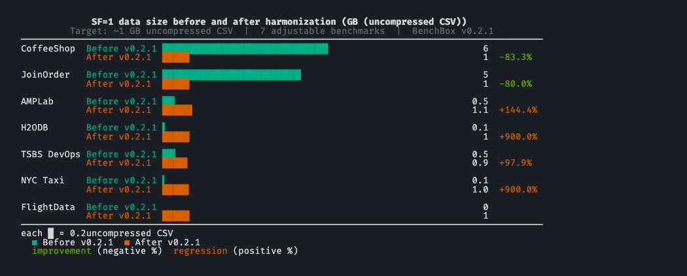

# One SF, one gigabyte: harmonizing scale factors across BenchBox

> Before v0.2.1, `--scale 1` could mean 96 MB or 6 GB depending on which benchmark you ran.

**TL;DR**: BenchBox v0.2.1 retunes 7 benchmarks with adjustable scale factors so that SF=1 produces roughly 1 GB of uncompressed CSV. CoffeeShop dropped from 6 GB to about 1 GB at SF=1; AMPLab grew from 450 MB to about 1.1 GB; H2ODB grew from 100 MB to about 1 GB. Spec-defined and fixed-size benchmarks (TPC-H, TPC-DS, SSB, ClickBench, DataVault) are unchanged.

> Current behavior note: the public `joinorder` benchmark now uses the fixed
> canonical IMDb 2013 JOB dataset at `--scale 1` only. The scalable synthetic
> JoinOrder generator discussed below was moved to the internal
> `joinorder_synthetic` benchmark for smoke tests.



---

## The problem: SF=1 meant nothing in particular

A scale factor (SF), the multiplier that determines how much data a benchmark generates, is the most visible knob in BenchBox's CLI. It is also the first number a user reaches for when budgeting time, storage, and money for a benchmark run.

Before v0.2.1, that knob meant whatever each benchmark's generator happened to produce at `SF=1.0`. Each benchmark inherited its own historical defaults, and we never went back to align them. The result was a set of generators that all accepted the same flag and all produced wildly different output sizes.

Here is what `--scale 1` meant for each adjustable benchmark before v0.2.1:

| Benchmark   | SF=1 size (before) | What SF=1 actually meant                        |
| ----------- | ------------------ | ----------------------------------------------- |
| CoffeeShop  | ~6 GB              | 78M order_lines, plus customers/products/orders |
| JoinOrder   | ~5 GB              | ~73M rows across 21 IMDB tables                 |
| AMPLab      | ~450 MB            | 50K documents, 100K rankings, 1M uservisits     |
| H2ODB       | ~100 MB            | 1M base_trips                                   |
| TSBS DevOps | ~470 MB            | 100 hosts x 1 day at 10s intervals              |
| NYC Taxi    | ~96 MB             | 1/100 sample of one year of yellow taxi         |
| FlightData  | n/a (new)          | (added in v0.2.1)                               |

The benchmarks outside the harmonization target were at least internally consistent, because either a spec defines their SF semantics or the dataset is fixed:

| Benchmark  | SF=1 size                   | Determined by           |
| ---------- | --------------------------- | ----------------------- |
| TPC-H      | ~1 GB                       | TPC spec                |
| TPC-DS     | ~2 GB                       | TPC spec                |
| SSB        | inherits TPC-H schema scale | Academic spec           |
| ClickBench | fixed (single dataset)      | Fixed benchmark dataset |
| DataVault  | inherits TPC-H              | TPC-H schema            |

The takeaway: when you said `--scale 1` to BenchBox, the output size depended entirely on which benchmark you picked. There was no shared baseline. Resource budgeting required a per-benchmark lookup, and "run everything at SF=1" was a meaningless instruction.

## Why pick 1 GB?

Picking a target was the first design decision, and it was less interesting than the second one (whether to make the change backwards-compatible). 1 GB was the convergent answer for three reasons:

1. **TPC-H already uses it.** TPC-H SF=1 is approximately 1 GB by spec, and TPC-H is the benchmark BenchBox users run most often. Aligning the rest of the catalog with TPC-H's convention preserves whatever intuition users have already built.
2. **It fits the way BenchBox already frames a standard local run on a developer laptop.** Our convention puts SF=1 at roughly 1 GB of data and 4-8 GB of working memory on a typical dev machine, large enough to be realistic without jumping to workstation-only sizes.
3. **It scales linearly to useful sizes.** SF=10 lands at roughly 10 GB, SF=100 at roughly 100 GB. These are the sizes users actually want for "small benchmark", "real benchmark", and "stress benchmark." A 1 GB anchor at SF=1 makes the scale ratio useful at every step.

We did not pick 1 GB because it is optimal for any specific platform. We picked it because it is the size that already had the most operational practice around it, and because aligning to a single number meant _picking one_. TPC-H's number was the obvious one to pick.

## The design decision: backwards-incompatible by intent

The harmonization changes output sizes at the same SF, so existing scripts will produce different data. We considered three options:

- **Opt-in flag (`--scale-target=1gb`).** Rejected: opt-in harmonization defeats the point of making `--scale 1` mean the same thing without flag knowledge.
- **Versioned benchmarks (`coffeeshop-v2`, and so on).** Rejected: every benchmark would carry its old definition forward forever, and users would have to remember which version produced which size.
- **Change the meaning of SF=1** with a clear changelog notice and a `--force datagen` recommendation for users with cached data. Adopted.

The principle: BenchBox is a benchmarking tool, not a regression test. Comparability across benchmarks at the same SF matters more than comparability against a single benchmark's old output across BenchBox versions. Cross-version comparisons were already fragile (driver versions, query rewrites, format changes), so the migration cost we added was incremental rather than novel.

## What changed, per benchmark

The row counts and sizes below come from each benchmark's current generator baseline. GB figures are approximate uncompressed CSV sizes for BenchBox-generated source data, not loaded table sizes inside a specific engine.

| Benchmark   | Before SF=1 | After SF=1 | Delta | What changed                                                     |
| ----------- | ----------- | ---------- | ----- | ---------------------------------------------------------------- |
| CoffeeShop  | ~6 GB       | ~1 GB      | -83%  | `order_lines` drops from 78M to ~13.3M                           |
| JoinOrder   | ~5 GB       | ~1 GB      | -80%  | IMDB tables scale down proportionally to preserve join ratios    |
| AMPLab      | ~450 MB     | ~1.1 GB    | +150% | Documents, rankings, and uservisits all scale up 2.5x            |
| H2ODB       | ~100 MB     | ~1 GB      | +900% | `base_trips` grows from 1M to 10M                                |
| TSBS DevOps | ~466 MB     | ~0.93 GB   | +100% | Duration fixes at 2 days; host count remains the scale dimension |
| NYC Taxi    | ~96 MB      | ~0.96 GB   | +900% | Yellow Taxi moves from a 1/100 sample to a 1/10 sample           |
| FlightData  | n/a         | ~1 GB      | New   | New benchmark calibrated to the harmonized baseline              |


### CoffeeShop (-83%)

- Old SF=1: 78M order_lines, ~6 GB
- New SF=1: ~13.3M order_lines, ~1 GB

CoffeeShop was the largest outlier. Its previous default made a "run the OLAP benchmarks at SF=1" workflow awkward to budget alongside TPC-H or TPC-DS on common development hardware. Bringing it down to ~1 GB makes that pipeline much easier to reason about.

### JoinOrder (-80%)

- Old SF=1: ~73M rows across 21 IMDB tables, ~5 GB
- New SF=1: ~14.7M rows across the same 21 tables, ~1 GB

JoinOrder's value as a benchmark depends on the cross-table cardinality ratios (the relative sizes of the joined tables). Reducing each table by the same factor preserves the join behavior the benchmark is designed to exercise.

Current BenchBox releases no longer expose this scaled synthetic data as the
public `joinorder` benchmark. Public `joinorder` uses the canonical IMDb 2013
JOB data package at `--scale 1`; synthetic scaled data remains internal as
`joinorder_synthetic`.

### AMPLab (+150%)

- Old SF=1: 50K documents, 100K rankings, 1M uservisits, ~450 MB
- New SF=1: 125K documents, 250K rankings, 2.5M uservisits, ~1.1 GB

AMPLab grew. The original defaults were small enough that many engines could finish the workload so quickly that SF=1 timings were less informative than they should have been. Scaling up gives the queries enough work to produce more useful timings.

### H2ODB (+900%)

- Old SF=1: 1M base_trips, ~100 MB
- New SF=1: 10M base_trips, ~1 GB

H2ODB also grew, by an order of magnitude. The previous default was useful for checking that the benchmark ran end to end, but it was a weak baseline for understanding how a platform behaved once the data stopped fitting into the smallest working set.

### TSBS DevOps (+100%, 2x)

- Old SF=1: 100 hosts x 1 day at 10s intervals, ~466 MB
- New SF=1: 100 hosts x 2 days at 10s intervals, ~932 MB

TSBS lands slightly under the 1 GB target because scaling has to stay one-dimensional. The benchmark naturally grows in two dimensions: number of hosts and duration. Multiplying both by SF means SF=10 produces 100x the data, not 10x. We fixed duration at 2 days and scale only `num_hosts`, accepting the ~70 MB shortfall at SF=1 in exchange for a linear scale curve. Without that fix, "run TSBS at SF=10" would mean a 100 GB output and "SF=100" would mean 10 TB, which is not what a user holding the SF=1 mental model would expect.


### NYC Taxi (+900%)

- Old SF=1: 1/100 sample of yellow taxi, ~96 MB
- New SF=1: 1/10 sample of yellow taxi, ~9.6M trips, ~0.96 GB

NYC Taxi grew tenfold. The new default samples a much more meaningful fraction of one year of yellow-taxi trips, which makes scan and planning differences easier to observe than they were with the old tiny sample.

### FlightData (new)

- SF=1: ~24M flights (about 41 months of BTS data), ~1 GB

FlightData ships in v0.2.1, so it was designed against the harmonized target from the start.

## What about TPC-H, TPC-DS, SSB, ClickBench, DataVault?

These sit outside the harmonization target. We did not touch them.

- **TPC-H** and **TPC-DS** define their own SF semantics in their official specs. Changing output sizes would break TPC compliance.
- **SSB** is built on TPC-H's schema and inherits its scaling.
- **ClickBench** is a single-dataset benchmark with fixed size; SF does not apply.
- **DataVault** is a TPC-H-derived schema with TPC-H row counts.

Their baseline sizes either come from an external spec (TPC-H, TPC-DS, SSB, DataVault) or from a fixed dataset (ClickBench). In practice, that means the boundary is not especially jarring: TPC-H and DataVault already sit near the 1 GB target, TPC-DS is larger by spec, and ClickBench is fixed regardless of SF.

## Real-data ceilings: where SF stops scaling

NYC Taxi and FlightData both pull from finite real-world corpora, so SF can only grow until the source data runs out. Both benchmarks emit a warning the moment a user hits that ceiling, not when the run fails an hour later.

### NYC Taxi: sample-rate ceiling

NYC Taxi's "scale factor" controls a sample rate over a fixed historical corpus. The formula `sample_rate = min(1.0, SF / 10.0)` saturates at SF=10 (sample rate hits 1.0). Above SF=10, asking for "more data" is meaningless: the corpus is already fully consumed. BenchBox emits a warning at SF=10 so users hit the ceiling with their eyes open rather than discovering a silent cap after the run.

### FlightData: corpus exhaustion

FlightData consumes BTS monthly data files. With ~41 months per SF unit, SF >= 11.12 exhausts the available corpus (BTS publishes one new month per month, so the ceiling will rise as future BenchBox releases roll the supported-year window forward; at v0.2.1 the corpus stands at 456 months, covering 1987 through 2024). Above that threshold, asking for more data means asking for data that does not exist, so BenchBox warns up front rather than letting the run fail mid-generation.

## Methodology

This post is about scale semantics, not query runtimes, so the evidence comes from BenchBox's generators, docs, and tests rather than from per-engine benchmark runs on specific hardware.

- **Version scope**: BenchBox v0.2.1 semantics, as documented in the changelog and current benchmark docs.
- **Row counts**: Current generator baselines and benchmark docs for each benchmark.
- **Size numbers**: Approximate uncompressed CSV source-data sizes. Where BenchBox publishes calibrated size tables, this post uses those. Where the harmonization tests project a size from an old measured baseline to a new row count, this post uses the projected figure.
- **Constraint behavior**: TSBS's fixed-duration scaling, NYC Taxi's sample-rate saturation, and FlightData's corpus ceiling come from the current generator and downloader logic, plus the harmonization tests that assert those boundaries.

## Limitations

- **Approximate sizes**: "1 GB" here is a planning target, not a byte-exact guarantee. Actual file sizes vary with formatting details and data distribution.
- **Generated data, not loaded storage**: These numbers describe generated source data, not compressed on-disk storage inside a database and not peak memory during execution.
- **No platform timing claims**: This post does not claim that a given SF will produce a specific runtime on a given engine or machine.
- **Moving corpus ceilings**: NYC Taxi and FlightData are real-data benchmarks with natural ceilings. FlightData's ceiling was 456 months of BTS data in v0.2.1, and that number will move upward as new monthly data is published.

## What this means for users

**If you have been using BenchBox at SF=1 already**: outputs for the 7 affected benchmarks will differ. Cached data should be regenerated with `--force datagen` to match the new baselines, or you will be running queries against pre-harmonization data that does not match the current documentation.

**If you are new to BenchBox**: SF=1 now means roughly 1 GB across the adjustable benchmarks. Smaller and larger scales are much more predictable than before, though they still have documented floors and ceilings: TSBS keeps a minimum host count at tiny SFs, NYC Taxi saturates at SF=10, and FlightData caps when the BTS corpus is exhausted.

**For multi-benchmark runs**: storage and runtime budgeting at the same SF is now meaningful. A pipeline that runs all 7 adjustable benchmarks at SF=1 will produce roughly 7 GB of uncompressed data, plus whatever the spec-defined and fixed-size benchmarks contribute.

**For published results**: results from before v0.2.1 are not directly comparable to results from v0.2.1+ for the affected benchmarks at the same SF, because the generated data sizes changed.

## What we would do differently

Two things we would revisit:

1. **Pick the target earlier.** This harmonization is a v0.2.1 change because the catalog grew to a size where the inconsistency became painful. Picking a target at v0.1.0 would have meant fewer affected benchmarks and no backwards-incompatibility window.
2. **Make the SF-vs-data-size relationship more prominent in `--dry-run`.** BenchBox already shows expected data volume in dry-run previews. What's missing is a single line that ties that estimate back to the benchmark's calibrated SF model so users can scan it at a glance.

## Try it yourself

```bash
# Generate at SF=1 and check the resulting data size for an affected benchmark
$ benchbox run --platform duckdb --benchmark coffeeshop --scale 1 --phases generate

# Compare to a spec-defined benchmark
$ benchbox run --platform duckdb --benchmark tpch --scale 1 --phases generate

# Preview what a run would do without executing it
$ benchbox run --dry-run ./preview --platform duckdb --benchmark amplab --scale 1
```

The `--phases generate` flag stops after data generation, which is useful for sanity-checking output sizes before running queries.

---

## References

- v0.2.1 changelog entry: [`CHANGELOG.md`](https://github.com/joeharris76/benchbox/blob/v0.2.1/CHANGELOG.md), "Scale factor harmonization" under Added
- Companion release post: [BenchBox v0.2.1 release summary](2026-04-26-v0-2-1-release-summary.md)
- Test coverage: `tests/unit/generators/test_scale_factor_harmonization.py` (validates the 0.8-1.3 GB target band per benchmark)
- Benchmark docs used for calibrated size tables: `docs/benchmarks/{amplab,h2odb,nyctaxi,tsbs-devops,flightdata}.md`
- Constraint logic: `benchbox/core/{tsbs_devops/generator.py,nyctaxi/downloader.py,flightdata/downloader.py}`
- Dry-run preview docs: `docs/usage/dry-run.md` (expected data volume in preview output)
- Per-benchmark generators: `benchbox/core/{coffeeshop,joinorder,amplab,h2odb,tsbs_devops,nyctaxi,flightdata}/`
- TPC-H specification (origin of the SF=1 = 1 GB convention): <http://www.tpc.org/tpch/>
- BTS On-Time Performance dataset (FlightData source): <https://www.transtats.bts.gov/>

_Questions or feedback? [Open an issue](https://github.com/joeharris76/benchbox/issues) or join the discussion._
