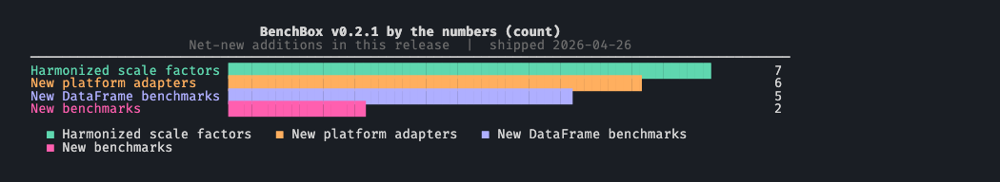

# BenchBox v0.2.1: 6 platforms, harmonized scale factors

> v0.2.1 is an expansion release: Six new platform adapters. Two new benchmarks.

**TL;DR**: New platforms: Apache Doris, CedarDB, StarRocks, SingleStore, QuestDB, and Apache Gluten + Velox. New benchmarks: Vector Search (recall@k + latency across 6 kNN/ANN queries) and FlightData (20 aviation analytics queries). NYC Taxi expands to four trip-record types. Scale factor changes to harmonize the meaning of SF=1 data sizes across 7 benchmarks.

> Current behavior note: the public `joinorder` benchmark now uses the fixed
> canonical IMDb 2013 JOB dataset at `--scale 1` only. The scalable synthetic
> JoinOrder behavior described for v0.2.1 was moved to the internal
> `joinorder_synthetic` benchmark for smoke tests.



---

BenchBox v0.2.1 shipped on **April 26, 2026**. v0.2.0 hardened the core pipeline enough to promote BenchBox to Beta. v0.2.1 is built on top of that foundation.

## Release highlights

- **Six new platform adapters**: Apache Doris, CedarDB, StarRocks, SingleStore, QuestDB, Apache Gluten + Velox.
- **Scale factor harmonization** across 7 benchmarks: CoffeeShop, JoinOrder, AMPLab, H2ODB, TSBS DevOps, NYC Taxi, and FlightData now target roughly 1 GB uncompressed at SF=1.
- **DataFrame mode coverage expanded** to five more benchmarks: Metadata Primitives, Transaction Primitives, TPC-Havoc, FlightData, and JoinOrder.
- **Vector Search benchmark** introduces BenchBox's first correctness-and-latency metric pair: 6 kNN/ANN queries reporting recall@k alongside latency.
- **FlightData benchmark** adds 20 analytical queries over US BTS on-time aviation data, with DataFrame support.
- **NYC Taxi expansion** adds Green Taxi, For-Hire Vehicle (FHV), and High-Volume FHV trip records alongside Yellow Taxi.
- **TPC-DS-OBT now defaults to Parquet output**. Use `--benchmark-option output_format=dat` to keep the old behavior.
- **ClickHouse split into three platforms**: `-local`, `-server`, and `-cloud`. Deployment mode is now explicit in the platform name rather than hidden behind branching.

## At a glance

| Area                       | What changed in v0.2.1                                                 | Why it matters                                                          |
| -------------------------- | ---------------------------------------------------------------------- | ----------------------------------------------------------------------- |
| New platforms              | Doris, CedarDB, StarRocks, SingleStore, QuestDB, Gluten+Velox          | Broader MPP and analytics engine coverage across the adapter catalog    |
| Scale factor harmonization | 7 adjustable benchmarks target roughly 1 GB at SF=1                    | Cross-benchmark size intuition holds when running the same scale factor |
| Vector Search benchmark    | 6 kNN/ANN queries; recall@k + latency; 6 dialect variants              | First BenchBox benchmark with a correctness metric alongside latency    |
| FlightData benchmark       | 20 analytical queries over BTS aviation data; DataFrame ready          | New analytical workload with real-world high-cardinality data shape     |
| NYC Taxi expansion         | Green, FHV, HVFHV trip records via `--benchmark-option taxi_types=...` | Run NYC Taxi against a wider slice of the actual taxi fleet             |
| Unofficial TPC-DS scales   | SF<1 supported via bundled patched dsdgen (non-comparable)             | Fast iteration on TPC-DS without spec-scale data sizes                  |
| ClickHouse split           | `clickhouse-local`, `clickhouse-server`, `clickhouse-cloud`            | Deployment mode is no longer hidden inside one adapter with branching   |

## What's different from v0.2.0

v0.2.1 is an expansion release: six new platform adapters, two new benchmarks, a ClickHouse architectural split, and a benchmark-data-size harmonization. This expansion is enabled by a new SQL compatibility subsystem that centralizes benchmark gating, query variants, dialect rewrites, schema emission, and DDL optimization. Before this, adding a new platform adapter required per-platform dialect handling. Now the per-platform work is primarily configuration: register rewrites and gate conditions; shared infrastructure handles the rest.

## Six new platform adapters

1. **Apache Doris** is an open-source MPP analytics engine for real-time workloads. BenchBox connects over the MySQL wire protocol and uses Stream Load for bulk ingest.
2. **CedarDB** (formerly Umbra from TU Munich) is a PostgreSQL-wire-compatible HTAP engine with JIT-compiled execution. BenchBox loads via `COPY` over the standard PostgreSQL client path.
3. **StarRocks** is a columnar OLAP engine with real-time materialized views and data-lake federation. BenchBox uses Stream Load with a Parquet handler.
4. **SingleStore** (formerly MemSQL) combines a row store and columnstore for simultaneous real-time ingest and analytical queries. BenchBox loads via `LOAD DATA LOCAL INFILE` with columnstore DDL.
5. **QuestDB** is a time-series database with designated timestamps, automatic time partitioning, and high-throughput ingestion. Its SQL surface differs meaningfully from standard Postgres SQL, so BenchBox ships a full dialect rewriter for CTEs, EXISTS predicates, and mixed-predicate queries.
6. **Apache Gluten + Velox** is a Spark accelerator: it replaces JVM operators with a Velox C++ vectorized engine, falling back to the JVM where Velox lacks coverage. BenchBox treats it as a distinct execution path underneath Spark.

## New benchmarks: Vector Search and FlightData

### Vector Search

Vector Search is the first BenchBox benchmark where the headline metric is a pair. Each query reports both **recall@k** (correctness: what fraction of the true k nearest neighbors were returned) alongside **latency**. Comparing two engines on latency alone misses whether they returned the same answers.

The benchmark includes 6 kNN/ANN queries with dialect variants for DuckDB, pgvector, Snowflake, ClickHouse, StarRocks, and Doris. It works for both exact-search engines (kNN) and approximate-index engines (HNSW, IVF) on the same workload. The recall@k metric makes the accuracy/latency tradeoff visible rather than hidden.

```bash
benchbox run --platform duckdb --benchmark vector_search --scale 0.01
```

### FlightData

FlightData adds 20 analytical queries over US Bureau of Transportation Statistics on-time aviation data. The dataset has a real-world data shape: high-cardinality string columns (carrier codes, airport codes), date arithmetic, delay distributions, and route-level aggregations. DataFrame mode is supported out of the box.

At SF=1, FlightData maps to roughly 24 million flight records (about 41 months of BTS aviation data), approximately 1 GB uncompressed. This aligns directly with the scale factor harmonization described below.

```bash
benchbox run --platform duckdb --benchmark flightdata --scale 0.1
```

## NYC Taxi expansion

NYC Taxi previously ran against Yellow Taxi trip records only. v0.2.1 adds three additional trip-record types from the NYC TLC dataset:

- **Green Taxi**: outer-borough taxis that began service in 2013, with different pickup/dropoff geography from Yellow
- **For-Hire Vehicle (FHV)**: traditional livery and limousine dispatches
- **High-Volume FHV (HVFHV)**: app-dispatched trips from Uber, Lyft, and similar services

Select which types to include using the new `--benchmark-option` flag:

```bash
benchbox run --platform duckdb --benchmark nyctaxi \
  --benchmark-option taxi_types=yellow,green,fhv,hvfhv
```

Each trip-record type has a different schema shape and volume profile, making multi-type runs useful for testing how a platform handles heterogeneous data from a single source.

## Scale factor harmonization

Seven adjustable-scale benchmarks now target roughly 1 GB of uncompressed CSV at SF=1: CoffeeShop, JoinOrder, AMPLab, H2ODB, TSBS DevOps, NYC Taxi, and FlightData. Spec-locked benchmarks (TPC-H, TPC-DS, SSB, ClickBench, DataVault) are unchanged.

Before v0.2.1, `--scale 1` produced wildly different output sizes across benchmarks, so cross-benchmark comparisons of cost, runtime, or storage at a specific scale factor were not useful. This change is backwards-incompatible for cached datasets: CoffeeShop SF=1 shrank; AMPLab and H2ODB grew substantially. Regenerate with `--force datagen` after upgrading.

We wrote up the design rationale and per-benchmark numbers separately: see the companion post [Scale factor harmonization: designing a consistent benchmark size model](2026-04-26-scale-factor-harmonization.md).

## ClickHouse split into three platforms

`clickhouse` now has three explicit platform names:

- `--platform clickhouse-local`: the embedded binary, no server required
- `--platform clickhouse-server`: a self-managed server
- `--platform clickhouse-cloud`: ClickHouse Cloud with TLS authentication

The previous single adapter encoded all three modes through internal branching. The split separates them because the behaviors differ in ways that matter: temp table semantics, system table availability, tuning DDL applicability, and connection handling (no network vs wire protocol vs TLS with auth). Bare `--platform clickhouse` remains a deprecated alias during the migration window (see "Changed behavior" below), but scripts should migrate to the explicit platform names.

The `deployment_mode` contract driving this split is reusable. Other multi-deployment platforms that share a dialect but differ in connection and loading behavior can follow the same pattern.

## Smaller changes with user-visible impact

**TPC-DS-OBT** (the one-big-table variant) now writes Parquet by default instead of `.dat` text. In our runs the Parquet output was smaller than the equivalent `.dat` files, and most platforms load Parquet without a text-to-columnar conversion step. Pass `--benchmark-option output_format=dat` to keep the old behavior.

**DataFrame mode** now covers five additional benchmarks: Metadata Primitives, Transaction Primitives, TPC-Havoc, FlightData, and JoinOrder. The DataFrame catalog is substantially closer to the SQL catalog.

**Two new CLI flags** round out the surface: `--benchmark-option K=V` (repeatable) carries benchmark-specific parameters like `taxi_types=yellow,green` or `output_format=dat` that do not belong on the global CLI, and `--iterations` makes the power-test measurement count explicit where it was previously implicit.

**TPC-DS at sub-spec scales** now works out of the box. Stock `dsdgen` segfaults at SF<1; BenchBox ships patched binaries that generate usable data at SF=0.01 and 0.1. These runs are unofficial and non-comparable to published results, but they make development iteration on TPC-DS practical without waiting on SF=1 generation.

## Stability and correctness follow-through

Apache Doris and StarRocks carried the expected new-adapter shake-out cycle: bulk loading hardened across timeouts, type handling, and retries; SQL compatibility extended across TPC-DI, TPC-DS-OBT, Vector Search, ClickBench, NYC Taxi, and Write Primitives; Docker startup stabilized; ARM64 support added for both adapters. The other new adapters saw the same pattern at smaller scale.

One ClickHouse fix deserves to be called out: TPC-DS power tests now report `FAILED` when no queries execute, where they previously passed silently. Query error messages are now surfaced in result output (also extended to Redshift and Firebolt), and dialect overrides landed for `tpcdi`, `coffeeshop`, `h2odb` Q9, `nyctaxi` EXTRACT, `tpchavoc` Q6, and `read_primitives`.

Other quality-of-life work this cycle: QuestDB query rewrites and `/imp` loader improvements; CedarDB, LakeSail, Firebolt, and Databend reliability fixes; `psycopg3` migration for pg-family adapters; DataVault SHA-256 hash keys; and benchmark-timeout enforcement on macOS. Full inventory in the [changelog](https://github.com/joeharris76/BenchBox/blob/main/CHANGELOG.md).

## Changed behavior to be aware of

- **`--platform clickhouse` is a deprecated alias.** Bare `clickhouse` resolves to `clickhouse-local` and `deployment_mode=server` resolves to `clickhouse-server` during the migration window. Migrate scripts to the explicit platform names.
- **TPC-DS-OBT defaults to Parquet.** Pass `--benchmark-option output_format=dat` for the old `.dat` behavior.
- **SF=1 data sizes changed for 7 adjustable benchmarks.** CoffeeShop, JoinOrder, AMPLab, H2ODB, TSBS DevOps, NYC Taxi, and FlightData may need regeneration with `--force datagen`. TPC-H, TPC-DS, SSB, ClickBench, and DataVault are unchanged.
- **psycopg3 migration.** pg-family adapters no longer require a psycopg2 pin.

## Quick upgrade checks

After upgrading to v0.2.1:

1. Confirm installed version:

```bash
benchbox --version
```

2. Run a smoke benchmark to verify the core path:

```bash
benchbox run --platform duckdb --benchmark tpch --scale 0.01 --phases power --non-interactive
```

3. Migrate any lingering bare `--platform clickhouse` scripts to an explicit platform name, and regenerate cached data for the 7 affected benchmarks:

```bash
benchbox run --platform clickhouse-local --benchmark tpch --scale 0.01 --dry-run ./preview
benchbox run --platform duckdb --benchmark coffeeshop --scale 1 --force datagen
```

4. Try the Vector Search benchmark on a supported platform to see the recall@k metric flow:

```bash
benchbox run --platform duckdb --benchmark vector_search --scale 0.01
```

## Bottom line

v0.2.0 hardened the core pipeline; v0.2.1 used that stability to expand the surface area with six new platform adapters, two new benchmarks, a ClickHouse adapter split, and a data-size harmonization that makes cross-benchmark reasoning at the same scale factor consistent.

Vector Search is new territory for BenchBox: we'd love your feedback, especially from anyone running it on a platform not in the initial dialect list. If you run into anything unexpected after upgrading, [open an issue](https://github.com/joeharris76/BenchBox/issues).

---

## Reference

- Changelog entry: `CHANGELOG.md` (`[0.2.1] - 2026-04-22`)
- Companion post: [Scale factor harmonization deep dive](2026-04-26-scale-factor-harmonization.md) (post #10 in this series)
- Previous release post: [BenchBox v0.2.0: Alpha to Beta](2026-04-01-v0-2-0-release-summary.md)
