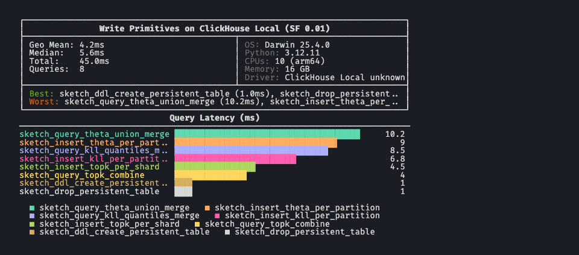

# Splitting approximate analytics across BenchBox read and write benchmarks

> Approximate aggregates answer one query over raw rows. Sketches store compact summary state that can be merged and queried later. BenchBox now tests those workloads separately.

**TL;DR**: Approximate analytics is not just a function-mapping problem. A platform can expose approximate aggregate functions without exposing the full sketch lifecycle (build compact state, store it, merge it later, query it). BenchBox now separates those two claims:

- `read_primitives` measures one-shot approximate aggregates: HLL distinct counts, KLL or T-Digest quantiles, vector quantiles, and Top-K.
- `write_primitives` measures persisted sketch state: store compact summaries, merge them later, validate the extracted answer, and track storage size.

The current `develop` branch also adds ClickHouse-native lifecycle coverage, DuckDB-only CPC and REQ variants, parameter sweeps, and a PySpark DataFrame HLL persist-merge path. Tuple sketches and cloud live verification remain deferred.

---



## Introduction

A support matrix would have been the obvious first response to Databricks' April 29, 2026 sketch announcement.[^1]

Theta: supported here, substituted there. KLL: supported here, skipped there. Top-K: supported here, missing there. That table is useful, and BenchBox has one now. But it does not answer the question the announcement actually raises.

Sketches become interesting when they stop being a single function call: built over partitions, stored as columns, merged across days or regions, and queried against compact state instead of raw rows. Once that is the claim, a benchmark cannot stop at "which function name maps where?"

The announcement was a useful forcing function for BenchBox: one-shot aggregate tests can measure function latency, but they cannot exercise stored, mergeable sketch artifacts.

A note up front about what BenchBox can and cannot claim here. The catalog covers many platforms and families, but catalog coverage is not the same as live, per-platform verification. Local `read_primitives` paths are straightforward to exercise; chDB gives a local ClickHouse-shaped path for the native `-State` and `-Merge` lifecycle; DuckDB KLL, CPC, and REQ work against the installed community extension, while DuckDB Theta and frequent-items remain blocked by community-extension drift. Snowflake, BigQuery, Databricks, and Redshift lifecycle runs remain credential-gated.

Databricks' SQL docs make that lifecycle explicit for Theta (`theta_sketch_agg`, `theta_union_agg`, `theta_sketch_estimate`), KLL (`kll_sketch_agg_double`, `kll_merge_agg_double`, `kll_sketch_get_quantile_double`), and Top-K (`approx_top_k_accumulate`, `approx_top_k_combine`, `approx_top_k_estimate`).[^2][^3][^4][^5][^6] BenchBox already had a single-query read benchmark. It needed a second benchmark shape for the persist, merge, and requery loop.

## Why parity was only the starting point

The announcement moved Databricks closer to sketch surfaces already present elsewhere in BenchBox's platform matrix. Snowflake documents DataSketches functions for approximate distinct counts and stateful Top-K functions that accumulate, combine, and estimate stored state.[^7][^8] BigQuery exposes HLL++ sketches and KLL quantile sketches as `BYTES` values that can be initialized, merged, and extracted later.[^9][^10] ClickHouse has long exposed the same lifecycle shape through aggregate-state combinators such as `uniqState` and `uniqMerge`. DuckDB covers the one-shot approximate aggregate surface with `approx_count_distinct`, `approx_quantile`, and `approx_top_k`.[^11][^12]

That competitive context makes the benchmark question sharper. BenchBox needs to show where Databricks now overlaps with existing platform capabilities, where the SQL shapes still differ, and which parts of the lifecycle are actually measurable across platforms.

## Why read_primitives was not enough

`read_primitives` is intentionally simple. Each query runs in isolation against benchmark tables and reports latency for one read shape: a filter, a join, a group-by, a percentile, a top-N query. That is the right home for one-shot approximate aggregates:

| Query | Capability |
|-------|------------|
| `approx_count_distinct_simple` | HLL distinct count, single value |
| `approx_count_distinct_groupby` | HLL distinct count per group |
| `approx_quantile_groupby` | KLL or T-Digest style single quantile |
| `approx_quantiles_array` | Multiple quantiles from one aggregate |
| `approx_top_k_lineitem` | Approximate most-frequent values |

Those queries are useful. They answer "how fast is this platform's approximate aggregate surface compared with its exact aggregate surface?" That is still worth benchmarking.

But the sketch lifecycle is a different workload. It has at least three steps:

1. Build per-partition sketch state.
2. Persist that state in a table or file.
3. Merge stored state and extract a scalar or list later.

The second and third steps are the interesting part. They turn "approximate aggregate" from a function call into a data management pattern. A single-query catalog can produce numbers for step one. It cannot exercise the durable state loop.

This surfaced as a framework-gap finding in our own planning notes: function-parity evaluation under-weights claims that depend on the benchmark execution model. Mapping names is necessary, but it is not enough. We also have to ask whether the benchmark can express the capability under test.

## From function parity to lifecycle tests

The first pass was the parity table. We mapped Databricks' sketch families against the other platforms that BenchBox targets:

| Platform | Distinct | Quantile | Top-K |
|--------|----------|----------|-------|
| DuckDB | `APPROX_COUNT_DISTINCT` | `APPROX_QUANTILE` | `APPROX_TOP_K` |
| Snowflake | `APPROX_COUNT_DISTINCT` | `APPROX_PERCENTILE` | `APPROX_TOP_K` |
| BigQuery | `APPROX_COUNT_DISTINCT` | `APPROX_QUANTILES` | `APPROX_TOP_COUNT` |
| Databricks | `approx_count_distinct` | `PERCENTILE_APPROX` | `approx_top_k` |
| ClickHouse | `uniq` | `quantileTDigest` | `topK` |
| Redshift | `APPROXIMATE COUNT(DISTINCT ...)` | `APPROXIMATE PERCENTILE_DISC` | no native top-K |
| DataFusion | `approx_distinct` | `approx_percentile_cont` | no native top-K |

That table belongs in `read_primitives`, and it now lives in the public approximate-functions doc.[^13] It is enough for aggregate latency, but not for persisted sketch state.

Then we looked at persistence. Two implementation options were on the table:

| Option | Benefit | Weakness |
|--------|---------|----------|
| Add sketch-like queries only to `read_primitives` | Small change, easy to explain, broad platform coverage | Only measures one-shot aggregate latency |
| Add a `sketch` category to `write_primitives` | Exercises persist, merge, and requery | Requires platform-specific DDL, binary column handling, validation tolerances, and skip rationale |

We chose both. `read_primitives` owns the one-query surface. `write_primitives` owns the lifecycle.

That choice also forced architecture work we would not have seen from the parity table alone. `write_primitives` already had per-platform SQL overrides for the operation body, but validation SQL was still single-body. That breaks as soon as ClickHouse writes with `uniqState` while validation still calls a DuckDB-only `datasketch_*` function. We added `validation_query.platform_overrides` so each platform can validate with its own sketch syntax.

The DataFrame write path had a separate gap. Its operation enum modeled row-level work: insert, bulk-load, update, delete, merge, transaction. Sketch persistence is aggregate-state work, not row maintenance. We added `AGGREGATE_PERSIST` and `AGGREGATE_MERGE` as explicit operation shapes so DataFrame platforms with sketch APIs can report build latency, durable state size, and merge latency without pretending the workload is row CRUD.

That is the larger lesson from the attempt: the benchmark shape mattered as much as the function map.

## The write_primitives sketch lifecycle

The first `write_primitives` sketch category models a full sketch lifecycle with eight core SQL operations:

| Operation | Stage | What it measures |
|-----------|-------|------------------|
| `sketch_ddl_create_persistent_table` | DDL | Creating a table with sketch-bearing columns |
| `sketch_insert_theta_per_partition` | INSERT | Building distinct-count sketches per partition |
| `sketch_insert_kll_per_partition` | INSERT | Building quantile sketches per partition |
| `sketch_insert_topk_per_shard` | INSERT | Building frequent-item sketches per shard |
| `sketch_query_theta_union_merge` | MERGE | Merging distinct-count sketches and extracting an estimate |
| `sketch_query_kll_quantiles_merge` | MERGE | Merging quantile sketches and extracting a median |
| `sketch_query_topk_combine` | MERGE | Merging frequent-item sketches and extracting top items |
| `sketch_drop_persistent_table` | DDL | Cleaning up the sketch table |

The catalog separates three kinds of support:

| Family | DataSketches-family or binary-oriented path | Native or substituted path | No-support cases |
|--------|---------------------------------------------|----------------------------|------------------|
| Theta distinct | Databricks, Snowflake, DuckDB extension | ClickHouse `uniqState` and `uniqMerge`; BigQuery and Redshift HLL substitution | DataFusion |
| KLL quantile | Databricks, Snowflake, BigQuery, DuckDB extension | ClickHouse `quantileTDigestState` and `quantileTDigestMerge` | Redshift, DataFusion |
| Top-K frequent items | Databricks, Snowflake, DuckDB extension | ClickHouse `topKState` and `topKMerge` | BigQuery, Redshift, DataFusion |
| CPC distinct | DuckDB extension | none today | Databricks, Snowflake, BigQuery, ClickHouse, Redshift, DataFusion |
| REQ quantile | DuckDB extension | none today | Databricks, Snowflake, BigQuery, ClickHouse, Redshift, DataFusion |

That table defines execution contracts, not rankings. When BenchBox says Redshift is HLL-only here, the catalog emits HLL-specific DDL and HLL merge SQL for the distinct-count path, then skips KLL and Top-K with rationale. When BenchBox says ClickHouse is native-but-distinct, it means the persisted state shape matches the benchmark lifecycle, while the bytes are not portable to Apache DataSketches readers.

The later DuckDB-only CPC and REQ rows are a different kind of coverage. They do not broaden the vendor matrix. They make local sketch-family trade-offs measurable: CPC versus Theta for serialized distinct-count state size, and REQ versus KLL for quantile error semantics and state size.

Validation has two layers for the headline merge operations.

The first layer is scalar bounds. Sketch outputs can vary across algorithms, parameters, and platforms. Exact equality would be the wrong contract. Bounds are wide enough to avoid false failures on healthy sketches and tight enough to catch obvious regressions, such as returning zero or merging the wrong column.

The second layer is storage-size validation where the platform exposes a practical byte-length probe. A sketch benchmark that measures only latency misses half of the cost model. Persisted state size affects table storage, cache behavior, network movement, and merge throughput. The current catalog uses DuckDB and ClickHouse probes where verified, while cloud byte-length checks remain deferred until cloud credentials are available.

Tuple sketches stay out of this first lifecycle category. Databricks includes them in the announcement, and they are important because they combine distinct counting with associated metrics such as sums or mins and maxes.[^1] BenchBox defers them because the cross-platform story is different: Databricks and Snowflake have a natural path; BigQuery, Redshift, and ClickHouse do not map cleanly to the same family. Adding Tuple now would make the first lifecycle benchmark broader while mixing unlike support models in the same table.

## What changed in the benchmark model

Approximate analytics has two operational phases: aggregate functions and sketch persistence.

The aggregate functions phase is a query like "give me an approximate distinct count now." Most analytical platforms have something here. Some use HLL, some use T-Digest, some use platform-specific Top-K accumulators, and a few still rely on SQL transpilation or hand-written variants. This is the path `read_primitives` measures.

The persisted-state phase asks a different question: can the platform build sketches over partitions, store them, merge them later, and extract answers cheaply? This is the path `write_primitives` measures. The platform matrix narrows at this tier, and the portability story becomes more specific. Some platforms expose Apache DataSketches-family artifacts. Some expose native aggregate-state combinators. Some expose HLL only. A few still do not expose any sketch lifecycle at all. (See the catalog-versus-live note in the introduction for what BenchBox can claim today.)

DataFrame support needs its own accounting. Polars, PySpark, DataFusion, pandas, Dask, Modin, and cuDF do not expose the same sketch surfaces. On the read side, some rows are sketch-backed and some rows fall back to exact aggregates. A pandas exact `nunique` timing is not semantically comparable to a PySpark HLL timing. On the write side, PySpark now has a CLI-runnable HLL persist-merge path; Top-K is guarded by runtime support; the other DataFrame platforms still lack a comparable sketch persistence API.

The pattern is reusable beyond sketches. Any feature announced as "stored, mergeable, requeryable" needs an execution-model check before we start writing parity tables. Vector indexes, materialized aggregates, search indexes, incremental materialized views, and ML feature stores all have the same shape. The question is not only "what function name maps to what?" It is "does this benchmark have the phases needed to test the claim?"

## Try it yourself

Run the one-shot approximate aggregate path first:

```bash
uv run -- benchbox run --platform duckdb --benchmark read_primitives \
  --queries approx_count_distinct_simple,approx_count_distinct_groupby,approx_quantile_groupby,approx_quantiles_array,approx_top_k_lineitem \
  --scale 1 \
  --non-interactive
```

Then run the sketch lifecycle where your target platform supports it. The DuckDB Theta and Top-K paths currently need the community-extension drift resolved first, so KLL is the safer local DuckDB lifecycle smoke:

```bash
uv run -- benchbox run --platform duckdb --benchmark write_primitives \
  --queries sketch_insert_kll_per_partition,sketch_query_kll_quantiles_merge \
  --scale 0.01 \
  --non-interactive
```

ClickHouse-native sketch state can be exercised locally through `clickhouse-local`. In a clean checkout, install the optional local ClickHouse dependency first with `uv sync --extra clickhouse-local`.

```bash
QUERIES="sketch_ddl_create_persistent_table,sketch_insert_theta_per_partition,sketch_insert_kll_per_partition,sketch_insert_topk_per_shard"
QUERIES="$QUERIES,sketch_query_theta_union_merge,sketch_query_kll_quantiles_merge,sketch_query_topk_combine,sketch_drop_persistent_table"

uv run -- benchbox run --platform clickhouse-local --benchmark write_primitives \
  --queries "$QUERIES" \
  --scale 0.01 \
  --non-interactive
```

For DataFrame read aggregates, run each platform separately and label sketch-backed versus exact-fallback results before comparing:

```bash
for platform in polars-df pyspark-df datafusion-df pandas-df dask-df; do
  uv run -- benchbox run --platform "$platform" --benchmark read_primitives \
    --queries approx_count_distinct_simple,approx_count_distinct_groupby,approx_quantile_groupby \
    --scale 0.1 \
    --non-interactive
done
```

For the PySpark write-side DataFrame path, start with HLL. Top-K depends on whether the active Spark distribution exposes the `approx_top_k_*` Python functions:

```bash
uv run -- benchbox run --platform pyspark-df --benchmark write_primitives \
  --queries sketch_df_hll_persist_merge \
  --scale 0.01 \
  --non-interactive
```

The public reference docs are the best place to start:

- [`read_primitives` approximate aggregate functions](https://github.com/joeharris76/BenchBox/blob/develop/docs/benchmarks/read-primitives-approximate-functions.md)[^13]
- [`write_primitives` sketch persistence operations](https://github.com/joeharris76/BenchBox/blob/develop/docs/benchmarks/write-primitives-sketch-functions.md)[^14]

## Test environment

This post was reviewed against `origin/develop` at commit `c48c299b4`. The v0.3.0 version bump has not yet landed on `develop`, so `pyproject.toml` still reads `0.2.1`; the public release will pin against the bump commit.

Evidence status for this post:

| Area | Evidence status | Notes |
|------|-----------------|-------|
| `read_primitives` approximate aggregate catalog | Implemented and documented | Covers the one-shot approximate aggregate surface |
| DataFrame approximate aggregate surface | Implemented and documented | Labels sketch-backed and exact-fallback paths separately |
| `write_primitives` KLL Databricks SQL overrides | Docs-checked | Uses typed Databricks SQL names; live Databricks verification is still credential-gated |
| `validation_query.platform_overrides` | Implemented and unit-covered | Lets each platform validate with its own sketch syntax |
| `AGGREGATE_PERSIST` / `AGGREGATE_MERGE` DataFrame operation shapes | Implemented and unit-covered | Models aggregate-state work separately from row maintenance |
| ClickHouse-native sketch lifecycle and storage-size probes | Locally exercised | Uses chDB / `clickhouse-local` for native `-State` and `-Merge` paths |
| DuckDB sketch families | Mixed local status | KLL, CPC, and REQ are locally exercised; Theta and frequent-items remain blocked by community `datasketches` extension drift |
| PySpark DataFrame HLL persist-merge path | CLI-runnable and runtime-gated | HLL runs through `sketch_df_hll_persist_merge`; Top-K skips when the Python client lacks `approx_top_k_*` functions |
| Cloud lifecycle runs | Deferred | Snowflake, BigQuery, Databricks, and Redshift runs require credentials |

## Limitations

Approximation error is out of scope here. A separate benchmark would need paired exact and approximate outputs, relative-error reporting, and workload-specific tolerance choices.

Cross-platform binary sketch portability is also out of scope. Persisting a sketch in one platform and reading it in another needs orchestration across two platforms and byte-level compatibility checks. BenchBox does not have that workflow today.

The support matrix separates catalog support from live verification. Cloud verification, cloud storage-size probes, and DuckDB extension pinning can fill in more of the matrix later.

## References

[^1]: Daniel Tenedorio, Kent Marten, Gengliang Wang, and Chenhao Li, ["Approximate Answers, Exact Decisions: New Sketch Functions for Analytics"](https://www.databricks.com/blog/approximate-answers-exact-decisions-new-sketch-functions-analytics), Databricks Blog, April 29, 2026.

[^2]: Databricks, [`theta_sketch_agg` aggregate function](https://docs.databricks.com/aws/en/sql/language-manual/functions/theta_sketch_agg), [`theta_union_agg` aggregate function](https://docs.databricks.com/aws/en/sql/language-manual/functions/theta_union_agg), and [`theta_sketch_estimate` function](https://docs.databricks.com/aws/en/sql/language-manual/functions/theta_sketch_estimate), accessed May 18, 2026.

[^3]: Databricks, [`kll_sketch_agg_double` aggregate function](https://docs.databricks.com/aws/en/sql/language-manual/functions/kll_sketch_agg_double), accessed May 18, 2026.

[^4]: Databricks, [`kll_merge_agg_double` aggregate function](https://docs.databricks.com/aws/en/sql/language-manual/functions/kll_merge_agg_double), accessed May 18, 2026.

[^5]: Databricks, [`kll_sketch_get_quantile_double` function](https://docs.databricks.com/aws/en/sql/language-manual/functions/kll_sketch_get_quantile_double), accessed May 18, 2026.

[^6]: Databricks, [`approx_top_k_accumulate` aggregate function](https://docs.databricks.com/aws/en/sql/language-manual/functions/approx_top_k_accumulate), [`approx_top_k_combine` aggregate function](https://docs.databricks.com/gcp/en/sql/language-manual/functions/approx_top_k_combine), and [`approx_top_k_estimate` function](https://docs.databricks.com/aws/en/sql/language-manual/functions/approx_top_k_estimate), accessed May 18, 2026.

[^7]: Snowflake, [`DATASKETCHES_HLL`](https://docs.snowflake.com/en/sql-reference/functions/datasketches_hll), accessed May 18, 2026.

[^8]: Snowflake, [`APPROX_TOP_K_ACCUMULATE`](https://docs.snowflake.com/en/sql-reference/functions/approx_top_k_accumulate), accessed May 18, 2026.

[^9]: BigQuery, [HyperLogLog++ functions](https://docs.cloud.google.com/bigquery/docs/reference/standard-sql/hll_functions), accessed May 18, 2026.

[^10]: BigQuery, [KLL quantile functions](https://docs.cloud.google.com/bigquery/docs/reference/standard-sql/kll_functions), accessed May 18, 2026.

[^11]: ClickHouse, ["Using Aggregate Combinators in ClickHouse"](https://clickhouse.com/blog/aggregate-functions-combinators-in-clickhouse-for-arrays-maps-and-states), accessed May 18, 2026.

[^12]: DuckDB, [Aggregate Functions](https://duckdb.org/docs/stable/sql/functions/aggregates), accessed May 18, 2026.

[^13]: BenchBox, [`read_primitives` approximate aggregate functions](https://github.com/joeharris76/BenchBox/blob/develop/docs/benchmarks/read-primitives-approximate-functions.md), accessed May 18, 2026.

[^14]: BenchBox, [`write_primitives` sketch persistence operations](https://github.com/joeharris76/BenchBox/blob/develop/docs/benchmarks/write-primitives-sketch-functions.md), accessed May 18, 2026.

*Questions or feedback? [Open an issue](https://github.com/joeharris76/BenchBox/issues) or join the discussion.*
