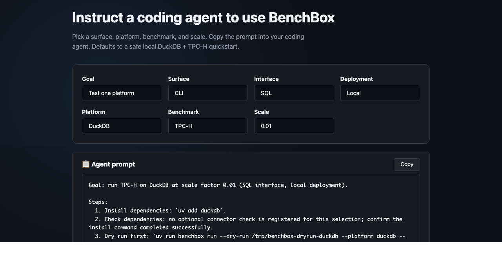

# BenchBox v0.3.0: JoinOrder fix, approximate analytics, and agent prompt composer

**TL;DR**: The new [/prompts/](https://benchbox.dev/prompts/) page composes benchmarking instructions for coding agents. `joinorder` now uses the real IMDb 2013 Join Order Benchmark dataset at scale factor 1, replacing synthetic data. BenchBox also expands approximate-aggregate and sketch-lifecycle coverage in the primitives benchmarks.

---



The headline addition is a new [`/prompts/`](https://benchbox.dev/prompts/) page on the landing site. It composes copyable instructions for coding agents so that a first BenchBox run, local or cloud, lands with safer defaults and the right setup steps in the right order. No new runtime command, no MCP tool change, no JSON catalog: the page is a prompt composer over BenchBox's existing CLI and MCP surfaces.

The biggest data-contract change is JoinOrder. A community report ([issue #289](https://github.com/joeharris76/BenchBox/issues/289)) flagged that BenchBox's old JoinOrder data was synthetic and did not exercise the real-world correlations that the Join Order Benchmark was designed around. Thanks to `@partychicken` for raising the issue. v0.3.0 fixes this by making `joinorder` use the real IMDb 2013 JOB dataset at scale factor 1. The companion post, [Reworking JoinOrder around the IMDb 2013 dataset](./2026-05-18-joinorder-imdb-2013-dataset.md), walks through the data contract, scale-factor decision, and provenance work in detail.

The third theme is approximate analytics. BenchBox now covers more of the path that modern platforms expose for approximate aggregates and sketches: one-shot approximate read queries, persisted sketch state, merge queries, storage-size checks, and parameter sweeps where the platform surface supports them. The architecture deep-dive in [Splitting approximate analytics across BenchBox read and write benchmarks](./2026-05-18-sketch-functions-databricks-response.md) covers why the work split across `read_primitives` and `write_primitives`.

## At a glance

| Area | What changed in v0.3.0 | Why it matters |
| --- | --- | --- |
| Agent prompts | `/prompts/` emits copyable CLI or MCP agent instructions | Visitors get a safer starting point for agent-assisted benchmarking |
| JoinOrder data | `joinorder` uses the real IMDb 2013 JOB dataset at SF=1 | Fixes a user-raised comparability issue |
| JoinOrder queries | 113 JOB SQL queries, with reference cardinalities and predicate tests | Runs the optimizer workload readers expect |
| Dataset identity | Result bundles can record dataset version and hashes | Published results can be audited later |
| Approximate reads | `read_primitives` adds approximate aggregate coverage | Users can test approximate behavior without writing one-off queries |
| Sketch writes | `write_primitives` adds sketch persist, merge, requery, storage-size, and sweep coverage | Users can measure more of the sketch lifecycle |

## Create prompts for agent-assisted benchmarking

This release adds a [new prompt composer page](https://benchbox.dev/prompts/) where you can "Instruct a coding agent to use BenchBox."

The page allows you to assemble a common first-run workflow and hand it off to your agent. Instead of asking the agent to infer the right BenchBox setup from memory, you can assemble instructions for a workflow that will run a benchmark correctly.

Choose from:

- goal: test one platform or compare platforms
- surface: CLI or MCP
- interface: SQL or DataFrame
- deployment model: local, self-hosted, or managed cloud
- platform, benchmark, and scale

It then emits a copyable prompt. If MCP is selected, it includes the MCP configuration shape. If a managed cloud platform is selected, the generated instruction starts with dependency and status checks, then a dry run, before any live benchmark command.

The default path is intentionally conservative: local DuckDB, TPC-H, and SF 0.01. For managed platforms, the prompt tells the agent not to ask for secrets in chat or the browser; if credentials are missing, the agent should stop and summarize what is missing instead of guessing.

The page does not change how BenchBox runs benchmarks. There is no new `benchbox prompts` command, no new MCP prompt-rendering tool, and no public JSON catalog. Platform inclusion comes from BenchBox runtime metadata; hand-authored configuration supplies labels and safety copy.

## JoinOrder now means the real JOB dataset

In v0.3.0, `joinorder` switches to the real IMDb 2013 dataset, accepts only `--scale 1`, and ships with all 113 JOB SQL queries (IDs in the familiar `1a`, `2b`, `15a` shape, registered and parse-checked in the test suite). The previous synthetic data path is renamed `joinorder_synthetic` and kept out of the released benchmark list; old synthetic result bundles are renamed in step so they aren't confused with results from the real dataset.

This is a breaking change. Before v0.3.0, it was easy to produce a result labeled "JoinOrder" that was not comparable to the workload described by the JOB papers, and that ambiguity now disappears. There is no small public JoinOrder scale in this release; a smaller workload may follow later, but it needs its own validated data contract, not a random slice of the real one.

Result bundles for manifest-backed datasets can also now record `dataset_version`, `manifest_hash`, and `data_archive_hash`. Hardware, platform version, and methodology still matter, but these fields make one question easier to answer later: which data did this result use? See [Reworking JoinOrder around the IMDb 2013 dataset](./2026-05-18-joinorder-imdb-2013-dataset.md) for the full rationale.

## More approximate aggregate coverage

`read_primitives` now includes five approximate aggregate queries:

| Query | What it measures |
| --- | --- |
| `approx_count_distinct_simple` | Approximate distinct count for one value |
| `approx_count_distinct_groupby` | Approximate distinct count per group |
| `approx_quantile_groupby` | Approximate single quantile per group |
| `approx_quantiles_array` | Multiple approximate quantiles from one aggregate |
| `approx_top_k_lineitem` | Approximate most-frequent values |

This also fixes a naming problem. The older `intrinsic_appx_median` query used an exact percentile expression despite the "appx" name; in v0.3.0 it becomes `approx_quantile_groupby`, with sketch-backed implementations on the PySpark and DataFusion paths.

DataFrame coverage is uneven by design, because platforms expose different APIs. The five query IDs do not all mean sketch-backed execution on every DataFrame platform:

| Platform | `approx_count_distinct_*` | `approx_quantile_groupby` | `approx_quantiles_array` | `approx_top_k_lineitem` |
| --- | --- | --- | --- | --- |
| Polars | Sketch | Exact | n/a | n/a |
| PySpark | Sketch | Sketch | skipped | skipped |
| DataFusion | Sketch | Sketch | n/a | n/a |
| Dask | HLL (simple) / exact (groupby) | Exact | n/a | n/a |
| Pandas, Modin, cuDF | Exact | Exact | n/a | n/a |

The documentation flags the splits so users don't accidentally compare exact and approximate implementations as if they were the same workload.

## Sketch workflows now cover persistence and merge

Approximate aggregate functions are useful, but they are only one part of the modern sketch workflow. Many platforms also let users build sketch state, store it, merge it later, and extract an estimate without scanning raw rows again. v0.3.0 moves that lifecycle into `write_primitives`, which is the right home because it involves creating tables, storing state, and reading state back later.

The new workloads cover persist, merge, and requery behavior, with storage-size validation alongside timing because persisted sketches have two costs that matter: how long they take to merge, and how much state they store. Parameter sweeps make the tradeoff visible where supported. KLL configurations, for example, can be compared by size and accuracy settings instead of treated as one fixed black box.

Platform support is genuinely uneven:

| Platform | Theta | KLL | Top-K | HLL | CPC / REQ | Notes |
| --- | --- | --- | --- | --- | --- | --- |
| Apache DataSketches implementations | yes | yes | yes | yes | n/a | Portable binary state |
| ClickHouse | yes* | yes* | yes* | yes* | n/a | Aggregate-state functions; format not portable across platforms |
| Redshift | no | no | no | yes | n/a | Native HLL only |
| DuckDB | drift | yes | drift | yes | yes | Community `datasketches` extension; Theta + frequent-items skipped until extension catches up |

BenchBox surfaces these differences as skips with reasons rather than hiding them behind a single "supported" label.

## Other notable changes

Validation queries can now use `ValidationQuery.platform_overrides`, which lets a benchmark declare platform-specific validation SQL or an explicit skip. That's useful for sketch state, since platforms expose different storage and merge functions. PySpark also gained a CLI-runnable HLL persist-merge path (`sketch_df_hll_persist_merge`) on the DataFrame write side; Top-K is runtime-gated and skips when the active Spark distribution lacks the `approx_top_k_*` Python functions.

## Try it yourself

```bash
uv add "benchbox[duckdb]"
uv run benchbox run --platform duckdb --benchmark tpch --scale 0.01
```

For JoinOrder, the public benchmark is the full fixed dataset:

```bash
uv run benchbox run --platform duckdb --benchmark joinorder --scale 1
```

The first JoinOrder run downloads and verifies the dataset before executing queries.

For the new approximate aggregate queries:

```bash
uv run -- benchbox run --platform duckdb --benchmark read_primitives \
  --queries approx_count_distinct_simple,approx_count_distinct_groupby,approx_quantile_groupby \
  --scale 1 \
  --non-interactive
```

For a locally-runnable slice of the sketch lifecycle (KLL on DuckDB's community extension):

```bash
uv run -- benchbox run --platform duckdb --benchmark write_primitives \
  --queries sketch_insert_kll_per_partition,sketch_query_kll_quantiles_merge \
  --scale 0.01 \
  --non-interactive
```

The deep-dive post has the full set of invocations including ClickHouse-native and PySpark DataFrame paths. For the new prompt page, visit `/prompts/`.

## Changed behavior to be aware of

- **`joinorder` is now fixed at SF=1.** Scripts that pass smaller JoinOrder scale factors need to change.
- **Old JoinOrder synthetic results are not comparable to v0.3.0 JoinOrder results.** Treat them as a different workload.
- **The old synthetic data path is now `joinorder_synthetic`.** It remains useful for development and smoke coverage, but it is not the released comparable benchmark.
- **Approximate DataFrame paths differ by platform.** Some are sketch-backed; others are exact fallbacks. Check the coverage matrix before comparing them.

---

## References

- Changelog entry: `CHANGELOG.md` (`[0.3.0] - 2026-05-18`)
- JoinOrder issue: [GitHub issue #289](https://github.com/joeharris76/BenchBox/issues/289)
- JoinOrder paper: [How Good Are Query Optimizers, Really?](https://www.vldb.org/pvldb/vol9/p204-leis.pdf)
- Companion post: [Reworking JoinOrder around the IMDb 2013 dataset](./2026-05-18-joinorder-imdb-2013-dataset.md)
- Approximate functions reference: `docs/benchmarks/read-primitives-approximate-functions.md`
- Sketch functions reference: `docs/benchmarks/write-primitives-sketch-functions.md`
- Prompt route decision: `_project/decisions/landing-prompts-route.md`
